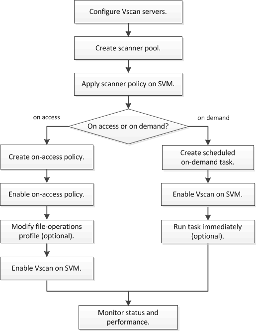

= ウィルススキャンのワークフロー
:icons: font
:imagesdir: ../media/

[role="lead"]
スキャンを有効にする前に、スキャナプールを作成し、スキャナポリシーを適用する必要があります。通常、 SVM に対してオンアクセススキャンとオンデマンドスキャンの両方を有効にします。

[NOTE]
====
CIFS の設定を完了しておく必要があります。

====

