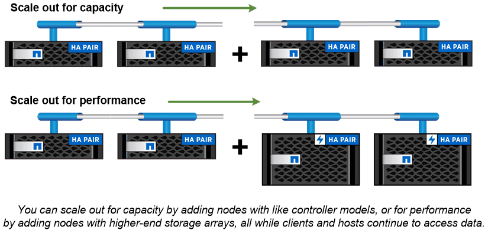

= クラスタストレージ
:allow-uri-read: 
:icons: font
:imagesdir: ../media/

[role="lead"]
ONTAP の現在のバージョンは、もともとはネットアップのスケールアウトクラスタストレージアーキテクチャ用に開発されたものです。これは、 ONTAP のデータセンター実装で一般的に採用されているアーキテクチャです。この実装でほとんどの ONTAP の機能が使用されるため、最初は ONTAP テクノロジの概念を理解しておくことを推奨します。

一般にデータセンターアーキテクチャでは、 ONTAP データ管理ソフトウェアを実行する専用の FAS コントローラまたは AFF コントローラを導入します。各コントローラとそのストレージ、ネットワーク接続、およびコントローラで実行されている ONTAP のインスタンスを合わせて、 _node._ と呼びます

ノードはハイアベイラビリティ（ HA ）ペアを構成します。このペアを複数配置したものがクラスタです（ SAN の場合は最大 12 ノード、 NAS の場合は最大 24 ノード）。ノードは、専用のプライベートなクラスタインターコネクトを介して相互に通信します。

ノードストレージは、コントローラのモデルに応じて、フラッシュディスク、大容量ドライブ、またはその両方で構成されます。データへのアクセスはコントローラのネットワークポートから提供されます。物理ストレージとネットワーク接続のリソースは仮想化され、クラスタ管理者のみが見ることができ、 NAS クライアントや SAN ホストからは見えません。

HA ペアの各ノードで同じストレージアレイモデルを使用する必要があります。それ以外の場合は、サポートされている任意のコントローラの組み合わせを使用できます。スケールアウトすることで、容量を増やすには同じストレージアレイモデルを使用するノードを追加し、パフォーマンスを高めるにはハイエンドのストレージアレイを使用するノードを追加します。

もちろん、従来の方法によるスケールアップもすべて可能で、必要に応じてディスクやコントローラをアップグレードできます。ONTAP の仮想ストレージインフラでは、データを無停止で簡単に移動できるため、スケールアップやスケールアウトをダウンタイムなしで実行できます。

