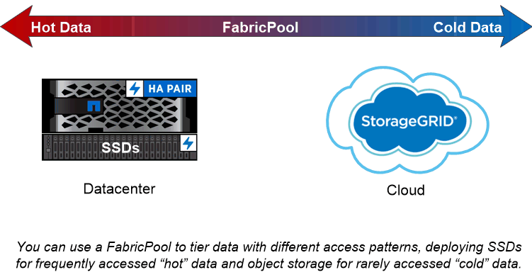

= ディスクとアグリゲートの概要
:allow-uri-read: 
:icons: font
:imagesdir: ../media/

[role="lead"]
_aggregates _ は、ノードで管理されるディスクのコンテナです。アグリゲートを使用することで、パフォーマンス要件に応じてワークロードを分離したり、アクセスパターンに応じてデータを階層化したり、規制要件に準拠する目的でデータを分離したりできます。

* レイテンシを最小限に抑えながらパフォーマンスを最大限に高めることが求められるビジネスクリティカルなアプリケーションに対しては、 SSD だけで構成されるアグリゲートを作成できます。
* アクセスパターンに応じてデータを階層化する場合は、 _hybrid アグリゲートを作成し、作業データセットには高性能なキャッシュとしてフラッシュを導入しながら、アクセス頻度が低いデータには低コストの HDD またはオブジェクトストレージを使用することができます。a_FlashPool _ は SSD と HDD の両方で構成されます。a_ssd FabricPool _ は、オブジェクトストアが接続されたオール SSD アグリゲートで構成されています。
* 規制要件に準拠する目的でアクティブなデータとは別にアーカイブデータを保持する必要がある場合は、大容量 HDD のみ、またはハイパフォーマンス HDD と大容量 HDD で構成されるアグリゲートを使用できます。

