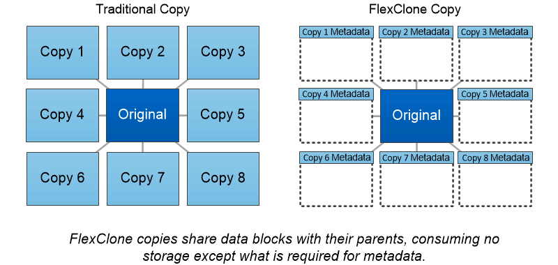

= FlexClone ボリューム、ファイル、 LUN
:icons: font
:imagesdir: ../media/

[role="lead"]
_FlexClone_technology は、 Snapshot メタデータを参照して、ボリュームの書き込み可能なポイントインタイムコピーを作成しています。コピーと親でデータブロックが共有されるため、変更がコピーに書き込まれるまでメタデータに必要な分しかストレージは消費されません。FlexClone ファイルと FlexClone LUN も使用するテクノロジは同じですが、元の Snapshot コピーは必要ありません。

従来の手法でコピーを作成すると数分から数時間かかりますが、 FlexClone ソフトウェアを使用すれば大規模なデータセットのコピーもほぼ瞬時に作成できます。そのため、同一のデータセットのコピーが複数必要な状況（仮想デスクトップ環境など）や一時的にデータセットのコピーが必要な状況（本番環境のデータセットでアプリケーションをテストする場合など）に適しています。

既存の FlexClone ボリュームをクローニングしたり、 LUN クローンを含むボリュームをクローニングしたり、ミラーやバックアップのデータをクローニングしたりできます。FlexClone ボリュームは親からスプリットできます。スプリットされた場合、コピーには独自のストレージが割り当てられます。

