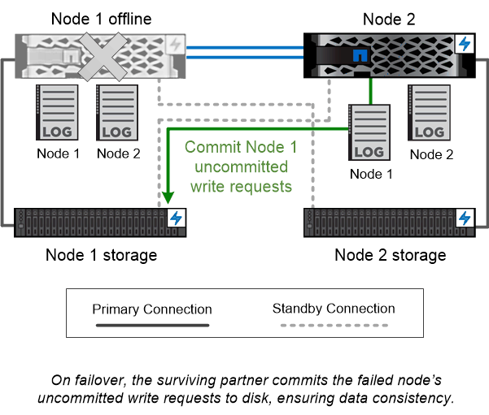

= ハイアベイラビリティペア
:allow-uri-read: 
:icons: font
:imagesdir: ../media/

[role="lead"]
クラスタノードは、フォールトトレランスとノンストップオペレーションを実現するために、 _high-availability （ HA ）ペア _ で構成されます。ノードに障害が発生した場合や定期的なメンテナンスのためにノードを停止する必要がある場合、パートナーはそのストレージをテイクオーバーしてデータの提供を継続できます。ノードがオンラインに戻ったときに、 partner_ギ ブバック _storage を提供します。

HA ペアは、必ず同じモデルのコントローラで構成されます。通常、コントローラは冗長電源装置を備えた同じシャーシに配置されます。

内部の HA インターコネクトにより、各ノードはパートナーが稼働しているかどうかを継続的に確認し、パートナーの不揮発性メモリのログデータをミラーリングできます。あるノードへの書き込み要求が発生した場合、両方のノードの NVRAM に要求が記録されたのち、クライアントまたはホストに応答が返されます。フェイルオーバーの際は、障害が発生したノードのコミットされていない書き込み要求が稼働しているパートナーによってディスクにコミットされてデータの整合性が維持されます。

テイクオーバーが発生した場合、各ノードはもう一方のコントローラのストレージメディアに接続して他方のノードのストレージにアクセスできます。ネットワークパスのフェイルオーバーメカニズムにより、クライアントとホストは稼働しているノードと引き続き通信できます。

可用性を確保するには、フェイルオーバー時の追加のワークロードに対応できるように、各ノードのパフォーマンス容量利用率を 50% に抑える必要があります。同じ理由で、 1 つのノードに割り当てる NAS 仮想ネットワークインターフェイスは最大数の 50% までにすることを推奨します。

|===

 a| 
*_ 仮想 ONTAP 実装でのテイクオーバーとギブバック _ *

ONTAP Select for AWS や Cloud Volumes ONTAP のような仮想化された「不要な」 ONTAP 環境では、ノード間でストレージが共有されません。ノードが停止した場合、そのノードのデータの同期ミラーリングされたコピーからパートナーがデータの提供を続行します。ノードのストレージはテイクオーバーせず、データ提供機能だけをテイクオーバーします。

|===