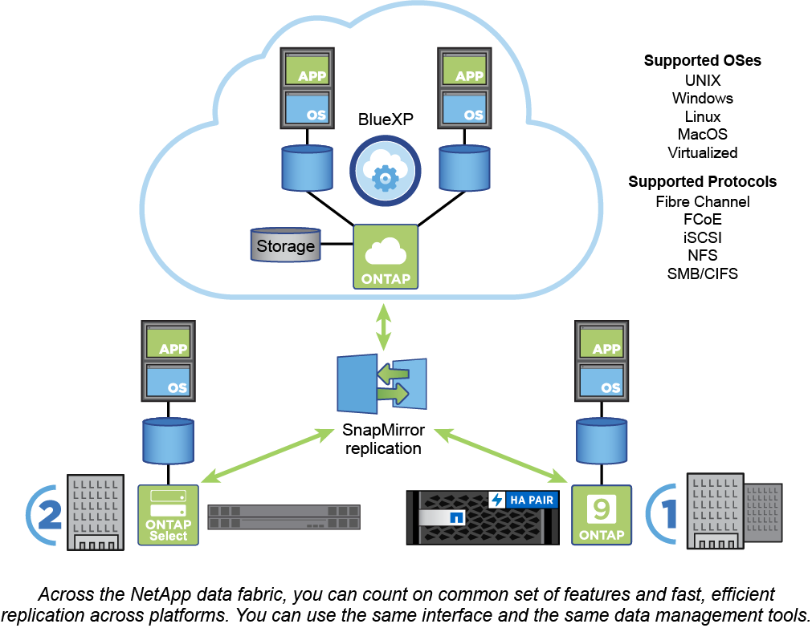

= ONTAPプラットフォーム
:allow-uri-read: 
:icons: font
:imagesdir: ../media/

[role="lead"]
ONTAP データ管理ソフトウェアは、ブロックアクセスプロトコルまたはファイルアクセスプロトコルを使用してデータを読み書きするアプリケーションに、ユニファイドストレージを提供します。高速フラッシュから低コストの回転式メディア、クラウドベースのオブジェクトストレージまで、さまざまなストレージ構成がサポートされます。

ONTAPの実装は、ネットアップが開発したFAS、AFF AシリーズとCシリーズ、オールSANフラッシュアレイASAプラットフォーム、コモディティハードウェア（ONTAP Select）、プライベートクラウド、パブリッククラウド、ハイブリッドクラウド（Cloud Volumes ONTAP）で実行されます。専門的な導入により、業界最高のコンバージドインフラ（FlexPod Datacenter）が提供されます。

これらの実装を組み合わせることで、 _ ネットアップデータファブリックの基本的なフレームワークが形作られます。 _ は、共通のソフトウェア定義型アプローチでデータを管理し、プラットフォーム間で高速かつ効率的なレプリケーションを実現します。

