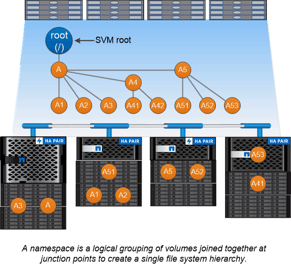

= ネームスペースとジャンクションポイント
:allow-uri-read: 
:icons: font
:imagesdir: ../media/

[role="lead"]
nas_namespace _ は、 _junction points_to によって結合されたボリュームを論理的にグループ化して、単一のファイルシステム階層を作成します。十分な権限を持つクライアントは、ストレージ内のファイルの場所を指定せずにネームスペース内のファイルにアクセスできます。ジャンクションされたボリュームはクラスタ内の任意の場所に配置できます。

NAS クライアントは、目的のファイルを含むすべてのボリュームをマウントするのではなく、 nfs_export_を マウントするか、 SMB_share にアクセスします。 _ エクスポートまたは共有は、ネームスペース全体またはネームスペース内の中間的な場所を表します。クライアントは、アクセスポイントより下にマウントされたボリュームにのみアクセスします。

ネームスペースには必要に応じてボリュームを追加できます。ジャンクションポイントは、親ボリュームジャンクションのすぐ下に作成することも、ボリューム内のディレクトリに作成することもできます。「 vol3 」という名前のボリュームのジャンクションへのパスは、「 /vol1/vol2/vol3`/vol1/vol3`1/vol3`/dir1/dir2/myvol3`vol3 」や「 /dir1/dir2/ vol3 」のようになります。このパスのことを _junction パスと呼びます。 _

SVM には、それぞれ一意のネームスペースがあります。SVM ルートボリュームは、ネームスペース階層へのエントリポイントです。

[NOTE]
====
ノードに障害やフェイルオーバーが発生したときにデータを引き続き利用できるようにするには、 SVM ルートボリュームに _load-sharing mirror_copy を作成する必要があります。

====

.例
次の例は、ジャンクションパスが「 /eng/home 」である「 home4` 」という名前のボリュームを SVM vs1 上に作成します。

[listing]
----
cluster1::> volume create -vserver vs1 -volume home4 -aggregate aggr1 -size 1g -junction-path /eng/home
[Job 1642] Job succeeded: Successful
----