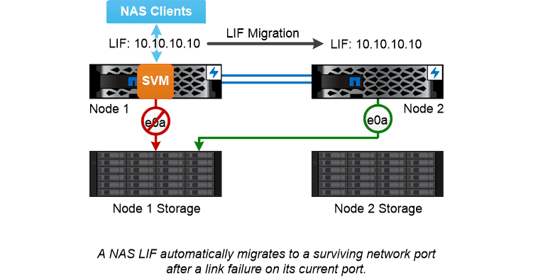

= NAS パスのフェイルオーバー
:allow-uri-read: 
:icons: font
:imagesdir: ../media/

[role="lead"]
NAS LIF は、現在のポートでリンク障害が発生すると、稼働しているネットワークポートに自動的に移行します。この移行先のポートは、 LIF の _failover group_ のメンバーである必要があります。_failover group policy_n を使用すると、データ LIF のフェイルオーバーターゲットが、データとその HA パートナーを所有するノード上のポートに移動します。

管理を容易にするため、 ONTAP ではネットワークアーキテクチャ内の各 _ ブロードキャストドメイン _ 用のフェイルオーバーグループが作成されます。ブロードキャストドメインは、同じレイヤ 2 ネットワークに属するポートをグループ化したものです。VLAN を使用している場合、たとえば部門（エンジニアリング、マーケティング、財務など）ごとにトラフィックを分離するには、各 VLAN で別々のブロードキャストドメインを定義します。ブロードキャストドメインに関連付けられたフェイルオーバーグループは、ブロードキャストドメインのポートを追加または削除するたびに自動的に更新されます。

ほとんどの場合、フェイルオーバーグループを最新の状態に保つために、ブロードキャストドメインを使用してフェイルオーバーグループを定義することを推奨します。ただし、ブロードキャストドメインに関連付けられていないフェイルオーバーグループを定義することもできます。たとえば、ブロードキャストドメインに定義されたポートの一部にのみ LIF をフェイルオーバーするように設定できます。

|===

 a| 
* _ サブネット _ *

a_subnet_ は、ブロードキャストドメイン内の IP アドレスのブロックを予約します。これらのアドレスは同じレイヤ 3 ネットワークに属し、 LIF の作成時にブロードキャストドメイン内のポートに割り当てられます。LIF アドレスを定義する場合、 IP アドレスとネットワークマスクを指定するよりもサブネット名を指定した方が一般に簡単で間違いも少なくなります。

|===