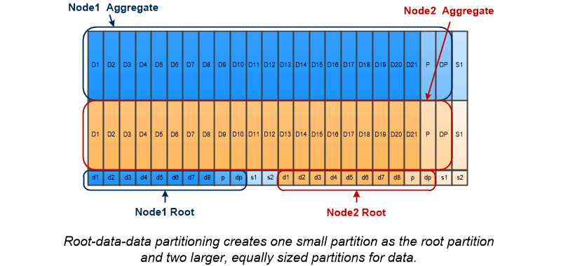

= ルート / データパーティショニング
:allow-uri-read: 
:icons: font
:imagesdir: ../media/

[role="lead"]
すべてのノードには、ストレージシステムの構成ファイル用のルートアグリゲートが必要です。ルートアグリゲートの RAID タイプは、データアグリゲートの RAID タイプと同じです

System Manager では、ルート / データパーティショニングやルート / データ / データパーティショニングはサポートされません。

RAID-DP タイプのルートアグリゲートは、通常、 1 つのデータディスクと 2 つのパリティディスクで構成されます。これは、アグリゲート内の各 RAID グループ用に 2 つのディスクがパリティディスクとしてすでにリザーブされている場合、ストレージシステムファイルの料金を支払う「パリティ税」として相当します。

_Root-data partitioning _ ルートアグリゲートを複数のディスクパーティションに分散し、各ディスク上にルートパーティションとして小さなパーティションを 1 つ、データ用に大きなパーティションを 1 つリザーブすることで、パリティの負担を軽減します。

image::../media/root-data.gif[ルート/データパーティショニングの例]

図からわかるように、ルートアグリゲートの格納に使用するディスクの数が多いほど、ルートパーティションは小さくなります。これは、ルート / データパーティショニングの一種である _root-data-data partitioning _ の場合でもあります。このパーティショニングでは、ルートパーティションとして小さなパーティションを 1 つ作成し、データ用に同じサイズの大きなパーティションを 2 つ作成します。

どちらのタイプのルート / データパーティショニングも、 ONTAP のアドバンストドライブパーティショニング（ ADP ）機能の一部です。どちらも出荷時点で構成され、エントリレベルの FAS2xxx 、 FAS9000 、 FAS8200 、 FAS80xx 、および AFF システムについてはルート / データパーティショニング、 AFF システムについてのみルート / データ / データパーティショニングが使用されます。

の詳細を確認してください link:https://kb.netapp.com/Advice_and_Troubleshooting/Data_Storage_Software/ONTAP_OS/What_are_the_rules_for_Advanced_Disk_Partitioning["アドバンストドライブパーティショニング"^]。

== ルートアグリゲート用にパーティショニングされたドライブ

ルートアグリゲートで使用するためにパーティショニングされるドライブは、システム構成によって異なります。

ルートアグリゲートに使用するドライブ数を把握しておくと、ルートパーティション用にリザーブするドライブの容量とデータアグリゲートで使用可能な容量を決定する際に役立ちます。

ルートデータのパーティショニング機能は、エントリレベルのプラットフォーム、オールフラッシュFAS プラットフォーム、およびSSDのみが接続されたFAS プラットフォームでサポートされます。

エントリレベルのプラットフォームでは、内蔵ドライブのみがパーティショニングされます。

SSDだけが接続されているAll Flash FAS プラットフォームおよびFAS プラットフォームでは、システムの初期化時にコントローラに接続されるすべてのドライブがパーティショニングされます。ノードあたりの最大数は24です。システムの構成後に追加されたドライブはパーティショニングされません。
