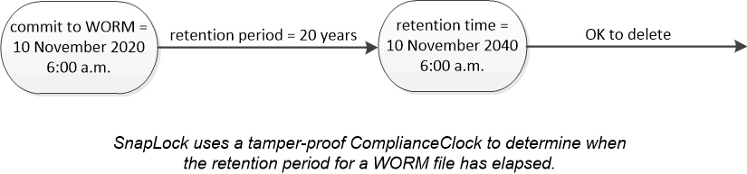

= WORM ストレージ
:allow-uri-read: 
:icons: font
:imagesdir: ../media/

[role="lead"]
_ 解決策 _ は、規制やガバナンスに準拠するために変更不可能な状態で重要なファイルを保管するために、 _Write Once 、 Read Many （ WORM ） _ ストレージを使用する組織向けの、ハイパフォーマンスなコンプライアンス SnapLock です。

1 つのライセンスで、 SEC Rule 17a-4 などの社外規定に準拠するための strict _ Compliance モードと、社内規定に準拠してデジタル資産を保護するためのより緩やかな _Enterprise モードで SnapLock を使用できます。SnapLock では、改ざん防止機能を備えた ComplianceClock _ を使用して、 WORM ファイルの保持期間が経過したかどうかを判断します。

SnapVault から WORM 方式でセカンダリストレージの Snapshot コピーを保護するには、 _ SnapLock for を使用します。SnapMirror を使用すると、ディザスタリカバリなどの目的で、地理的に離れた別の場所に WORM ファイルをレプリケートできます。

