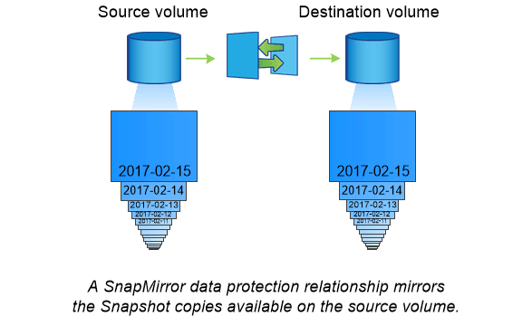

= SnapMirror によるディザスタリカバリとデータ転送
:icons: font
:imagesdir: ../media/

[role="lead"]
SnapMirror は、地理的に離れたサイトのプライマリストレージからセカンダリストレージへのフェイルオーバー用に設計されたディザスタリカバリテクノロジです。名前が示すように、 SnapMirror はセカンダリストレージに作業データのレプリカ（ _mirror ）を作成します。このデータから、プライマリサイトで災害が発生した場合にもデータの提供を継続できます。

データのミラーリングはボリュームレベルで行われます。プライマリストレージのソースボリュームとセカンダリストレージのデスティネーションボリュームの関係は、 _data 保護関係と呼ばれます。 _ ボリュームが存在するクラスタと、ボリュームからデータを提供する SVM は _peered になります。 _a ピア関係を設定することで、クラスタと SVM の交換が可能になります データをセキュアに保護

[TIP]
====
また、 SVM 間にデータ保護関係を作成することもできます。このタイプの関係では、 SVM のすべてまたは一部の設定が NFS エクスポートおよび SMB 共有から RBAC にレプリケートされます。また、 SVM が所有するボリューム内のデータもレプリケートされます。

====
SnapMirror を初めて起動すると、ソース・ボリュームからデスティネーション・ボリュームへの _ ベースライン転送 _ が実行されます。ベースライン転送の一般的な手順は次のとおりです。

* ソースボリュームの Snapshot コピーを作成します。
* Snapshot コピーおよびコピーが参照するすべてのデータブロックをデスティネーションボリュームに転送します。
* 「アクティブ」ミラーが破損した場合に備えて、ソースボリューム上の最新ではない残りの Snapshot コピーをデスティネーションボリュームに転送します。

ベースライン転送が完了すると、 SnapMirror は新しい Snapshot コピーだけをミラーに転送します。更新は、設定したスケジュールに従って非同期に行われます。保持処理によって、ソース上の Snapshot ポリシーがミラーリングされます。プライマリサイトで災害が発生した場合は最小限のシステム停止でデスティネーションボリュームをアクティブ化し、サービスが復旧したらソースボリュームを再アクティブ化できます。

ベースライン作成後は Snapshot コピーだけが転送されるため、無停止で高速なレプリケーションが可能です。フェイルオーバーの事例で示すように、ミラーリングされたストレージからデータを効率的に提供するには、セカンダリシステム上のコントローラがプライマリシステム上のコントローラと同じであるか、ほぼ同じである必要があります。

|===

 a| 
* _ SnapMirror を使用したデータ転送 _ *

SnapMirror を使用して、ネットアップデータファブリック内のエンドポイント間でデータをレプリケートすることもできます。SnapMirror ポリシーを作成するときに、レプリケーションを 1 回だけ行うか繰り返し行うかを選択できます。

|===