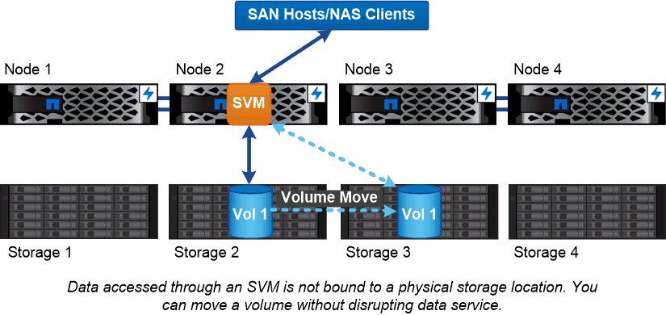

= ストレージ仮想化の概要
:allow-uri-read: 
:icons: font
:imagesdir: ../media/

[role="lead"]
クライアントやホストにデータを提供するには、 _Storage Virtual Machine （ SVM ） _ を使用します。SVM は、ハイパーバイザーで実行される仮想マシンと同様に、物理リソースを抽象化した論理エンティティです。SVM 経由でアクセスされるデータはストレージ内の場所にバインドされません。SVM へのネットワークアクセスは物理ポートにバインドされません。

[NOTE]
====
SVM は、以前は「 vservers 」と呼ばれていました。 ONTAP コマンドラインインターフェイス（ CLI ）では、現在も Vserver が使用されています。

====
SVM は、 1 つ以上のボリュームから 1 つ以上の network_logical interfaces （ LIF ；ネットワーク論理インターフェイス）を通じてクライアントおよびホストにデータを提供します。ボリュームは、クラスタ内の任意のデータアグリゲートに割り当てることができます。LIF は任意の物理ポートまたは論理ポートでホストできます。ハードウェアのアップグレード、ノードの追加、パフォーマンスの分散、アグリゲート間での容量の最適化などを行う際、ボリュームと LIF のどちらもデータサービスを中断することなく移動できます。

同じ SVM に NAS トラフィック用の LIF と SAN トラフィック用の LIF を設定することができます。クライアントとホストから SVM にアクセスするために必要なのは、 LIF のアドレス（ NFS 、 SMB 、 iSCSI の場合は IP アドレス、 FC の場合は WWPN ）だけです。LIF のアドレスは移動しても変わりません。ポートは複数の LIF をホストできます。SVM には、それぞれ独自のセキュリティ、管理、およびネームスペースがあります。

ONTAP では、データ SVM に加え、管理用の特別な SVM を使用します。

* クラスタのセットアップ時に _admin SVM_ が作成されます。
* ノードが新規または既存のクラスタに追加されると、 _node svm_is が作成されます。
* IPspace 内のクラスタレベルの通信用に、 _system svm_is を自動的に作成します。

これらの SVM はデータの提供には使用できません。また、クラスタ内およびクラスタ間のトラフィック用の LIF や、クラスタおよびノードの管理用の LIF もあります。

|===

 a| 
*_ ONTAP がミドルウェアに似ている理由 _ *

ONTAP がストレージ管理タスクに使用する論理オブジェクトは、適切に設計されたミドルウェアパッケージが従来担っていた役割を果たし、管理者を細かな実装作業から解放し、ノードやポートなどの物理仕様の変更が設定に影響しないようにします。管理者がストレージインフラ全体ではなく一部を再設定するだけで、ボリュームや LIF を簡単に移動できるようにすることが、基本的な目的です。

|===