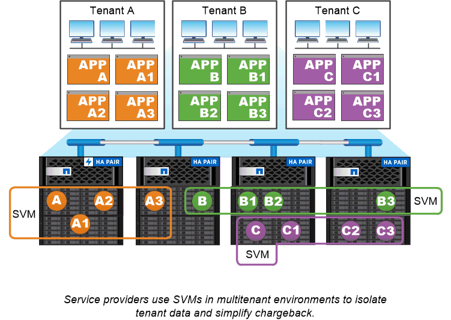

= SVM のユースケース
:icons: font
:imagesdir: ../media/

[role="lead"]
サービスプロバイダはセキュアなマルチテナンシー環境で SVM を使用し、各テナントのデータを分離し、テナントごとに専用の認証と管理を実装して、チャージバックを簡易化します。複数の LIF を同じ SVM に割り当てて異なる顧客のニーズに対応したり、 QoS を使用してテナントのワークロードが他のテナントのワークロード「 Bully 」にならないようにしたりすることができます。

企業の管理者も同じような目的に SVM を使用します。たとえば、データを部門別に分離したり、ホストがアクセスするストレージボリュームとユーザの共有ボリュームを別々の SVM に分けたりできます。iSCSI/FC LUN および NFS データストアと SMB 共有とで SVM を分ける管理者もいます。

