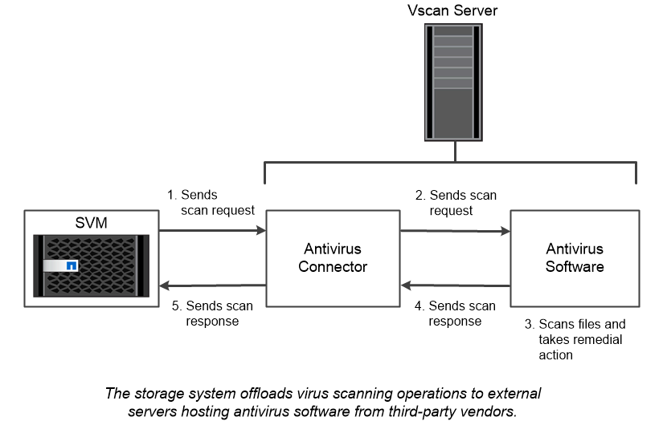

= ウィルススキャン
:allow-uri-read: 
:icons: font
:imagesdir: ../media/

[role="lead"]
ストレージシステムに統合されたウィルス対策機能を使用すると、ウィルスやその他の悪意のあるプログラムからデータを保護できます。ONTAP ウィルススキャン（ _vscan ）は、クラス最高のサードパーティ製ウィルス対策ソフトウェアと ONTAP 機能を組み合わせたもので、どのファイルをスキャンするか、いつスキャンするかを柔軟に制御できます。

スキャン処理は、サードパーティベンダーのウィルス対策ソフトウェアをホストする外部サーバにオフロードされます。ネットアップが提供し、外部サーバにインストールされる ONTAP Antivirus Connector は、ストレージシステムとウィルス対策ソフトウェア間の通信を処理します。

* クライアントが SMB 経由でファイルを開く、読み取る、名前を変更する、閉じるたびにウィルスチェックを行うには、 _on_access scanning_to を使用します。ファイル処理は、外部サーバからファイルのスキャンステータスが報告されるまで中断されます。ファイルがすでにスキャンされている場合、ONTAPはファイル操作を許可します。それ以外の場合は、サーバからのスキャンを要求します。
+
NFSではオンアクセススキャンはサポートされていません。

* オンデマンドスキャン _ を使用すると、ファイルのウィルスチェックをただちにまたはスケジュールに基づいて実行できます。たとえば、ピーク時を避けてスキャンを実行する場合などに便利です。外部サーバはチェックしたファイルのスキャンステータスを更新するため、SMB経由で次回ファイルがアクセスされたときにそれらのファイル（ファイルが変更されていなければ）のファイルアクセスレイテンシが短縮されます。
+
オンデマンドスキャンは、NFS経由でのみエクスポートされたボリュームも含め、SVMネームスペース内の任意のパスに対して使用できます。

通常は、SVMに対して両方のスキャンモードを有効にします。どちらのモードでも、ウィルス対策ソフトウェアはソフトウェアの設定に基づいて感染ファイルに対して修復アクションを実行します。

|===

 a| 
*_ 災害復旧および MetroCluster 設定でのウイルススキャン _ *

ディザスタリカバリ構成およびMetroCluster構成では、ローカルクラスタとパートナークラスタ用に個別のVscanサーバをセットアップする必要があります。

|===

