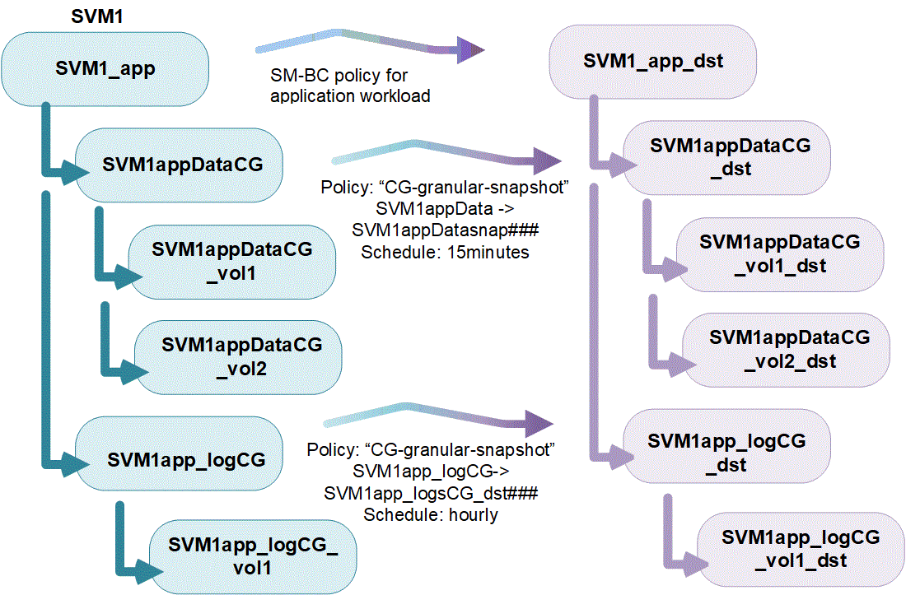

= 整合グループの概要
:allow-uri-read: 
:icons: font
:imagesdir: ../media/

[role="lead"]
整合グループは、1つのユニットとして管理されるボリュームの集まりです。ONTAPでは、整合グループを使用することで、複数のボリュームにまたがるアプリケーションワークロードの管理が容易になり、保護が保証されます。

整合グループを使用すると、ストレージ管理を簡易化できます。20個のLUNにまたがる重要なデータベースがあるとします。LUNを個別に管理することも、LUNを単一のデータセットとして扱い、単一の整合グループに編成することもできます。

整合グループを使用すると、アプリケーションワークロードの管理が容易になり、ローカルとリモートの保護ポリシーを簡単に設定できます。また、一連のボリュームについて、ある時点におけるcrash-consistentまたはアプリケーションと整合性のあるSnapshotコピーを同時に作成できます。整合グループ内の Snapshot を使用すると、アプリケーションのワークロード全体をリストアできます。

== 整合グループについて理解する

整合グループは、プロトコル（NAS、SAN、NVMe）に関係なく任意のFlexVol をサポートし、ONTAP REST APIまたは* Storage > Consistency Groups *メニュー項目でSystem Managerから管理できます。

整合グループは、個 々 のエンティティ（ボリュームの集まり）として作成することも、他の整合グループで構成される階層関係として作成することもできます。個 々 のボリュームには、独自のボリューム単位のSnapshotポリシーを設定できます。また、整合性グループ全体のSnapshotポリシーを作成することもできます。整合グループには、SnapMirror Business Continuity（SM-BC）関係と共有のSM-BCポリシーを1つだけ含めることができます。このポリシーを使用して整合グループ全体をリカバリできます。

次の図は、個 々 の整合グループを使用する方法を示しています。でホストされているアプリケーションのデータ `SVM1` 2つのボリュームにまたがっている： `vol1` および `vol2`。整合グループのSnapshotポリシーには、15分ごとにデータのSnapshotがキャプチャされます。

image:../media/consistency-group-single-diagram.gif["コンスティチュエントボリュームおよびローカル Snapshot ポリシーを含む単一の整合グループの図"]

アプリケーションワークロードが大きいほど、複数の整合グループが必要になる場合がありますこのような場合は、階層型整合グループを作成して、1つの整合グループが親整合グループの子コンポーネントになります。親整合グループには、最大 5 つの子整合グループを含めることができます。個々の整合グループと同様に、リモートの SM-BC 保護ポリシーを整合グループの設定全体（親と子）に適用して、アプリケーションワークロードをリカバリすることができます。

次の例では、アプリケーションがでホストされています `SVM1`。管理者が親整合グループを作成し、 `SVM1_app`を使用します。このグループには次の2つの子整合グループ `SVM1appDataCG` データおよび `SVM1app_logCG` をクリックします。子整合性グループには、それぞれ独自のSnapshotポリシーがあります。のボリュームのSnapshot `SVM1appDataCG` 15分ごとに服用してください。のSnapshot `SVM1app_logCG` 1時間ごとに作成されます。親整合グループ `SVM1_app` データを複製し、災害発生時にサービスを継続できるようにするSM-BCポリシーが用意されています。

ONTAP 9.12.1以降では、整合グループがサポートされます xref:clone-task.html[クローニング] 整合性のメンバーを変更するには、を使用します xref:modify-task.html[ボリュームを追加または削除する] System ManagerとONTAP REST APIの両方で使用できます。ONTAP 9.12.1以降では、ONTAP REST APIは次の機能もサポートします。

* 新しいNFSまたはSMBボリュームまたはNVMeネームスペースで整合グループを作成する。
* 新規または既存のNFS / SMBボリュームまたはNVMeネームスペースを既存の整合グループに追加する。

ONTAP REST APIの詳細については、を参照してください https://docs.netapp.com/us-en/ontap-automation/reference/api_reference.html#access-a-copy-of-the-ontap-rest-api-reference-documentation["ONTAP REST APIのリファレンスドキュメント"]。

== 整合グループを監視する

ONTAP 9.13.1以降では、整合グループで容量とパフォーマンスをリアルタイムおよび履歴で監視し、アプリケーションや個 々 の整合グループのパフォーマンスに関する分析情報を提供します。

整合グループの監視データは最大1年間保持されます。次の指標を追跡できます。

* パフォーマンス：IOPS、レイテンシ、スループット
* Capacity：サイズ、使用可能容量、使用済み容量

NOTE: 履歴の指標はREST APIでのみ取得できます。System Managerでは、過去の指標は表示されません。

== 整合グループを保護します

コンシステンシ・グループは'次の機能を使用

* Snapshot ポリシー
* xref:../smbc/index.html[SnapMirror のビジネス継続性（ SM-BC ）]
* <<mcc>> （9.11.1以降）
* xref:../data-protection/snapmirror-disaster-recovery-concept.html[非同期SnapMirror] （9.13.1以降）

整合性グループを作成しても、保護は自動的に有効になりません。ローカルとリモートの保護ポリシーは、整合グループの作成時または作成後に設定できます。

コンシステンシグループに保護を設定するには、を参照してください link:protect-task.html["整合グループを保護する"]。

リモート保護を利用するには、の要件を満たす必要があります xref:../smbc/smbc_plan_prerequisites.html#licensing[SnapMirror によるビジネス継続性の導入]。

NOTE: NAS アクセス用にマウントされたボリュームでは、 SM-BC 関係を確立できません。

== アプリケーションタグとコンポーネントタグ

ONTAP 9.12.1以降では、コンシステンシグループはコンポーネントおよびアプリケーションのタグ付けをサポートします。アプリケーションとコンポーネントのタグは管理ツールであり、整合グループ内のさまざまなワークロードをフィルタリングして識別できます。

タグには次の2種類があります。

* **アプリケーションタグ**:個 々 のコンシステンシグループと親コンシステンシグループに適用されます。アプリケーションタグは、MongoDB、Oracle、SQL Serverなどのワークロードにラベルを付けます。整合グループのデフォルトのアプリケーションタグはOtherです。
* **コンポーネントタグ**:階層整合グループの子には、アプリケーションタグではなくコンポーネントタグがあります。コンポーネントタグのオプションは、「data」、「logs」、または「other」です。デフォルト値はOtherです。

タグは、整合グループの作成時、または整合グループの作成後に適用できます。整合グループにSM-BC関係がある場合は、アプリケーションタグまたはコンポーネントタグに* other*を使用する必要があります。

== MetroCluster 構成の整合グループ

ONTAP 9.11.1以降では、MetroCluster 構成内のクラスタに新しいボリュームを含む整合グループをプロビジョニングできます。ミラーアグリゲートにプロビジョニングされています。

プロビジョニングが完了したら、整合グループに関連付けられているボリュームを、ミラーされたアグリゲートとミラーされていないアグリゲートの間で移動できます。したがって、整合グループに関連付けられたボリュームは、ミラーされたアグリゲート、ミラーされていないアグリゲート、またはその両方に配置できます。整合性グループに関連付けられているボリュームを含むミラーアグリゲートを変更して、ミラーされない状態にすることができます。同様に、整合グループに関連付けられたボリュームを含むミラーされていないアグリゲートを変更することで、ミラーリングを有効にすることができ

ミラーされたアグリゲートに配置された整合グループに関連付けられているボリュームとSnapshotがリモートサイト（サイトB）にレプリケートされます。サイトBのボリュームの内容によって整合グループの書き込み順序が保証されるため、災害発生時にサイトBからリカバリできます。レプリケートされた整合グループSnapshotには、ONTAP 9.11.1以降を実行しているクラスタで、整合グループSnapshot REST APIおよびSystem Managerを使用してアクセスできます。

整合グループに関連付けられている一部またはすべてのボリュームがミラーされていないアグリゲートに配置されていて、現在アクセスできない場合、整合グループに対するGET処理またはDELETE処理は、ローカルボリュームまたはホストアグリゲートがオフラインかのように動作します。

=== レプリケーション用のコンシステンシグループの設定

サイトBでONTAP 9.10.1以前が実行されている場合、ミラーされたアグリゲートにある整合グループに関連付けられているボリュームだけがサイトBにレプリケートされます整合グループの設定は、両方のサイトでONTAP 9.11.1以降が実行されている場合にのみサイトBにレプリケートされます。サイトBをONTAP 9.11.1にアップグレードしたあと、サイトAの整合グループのデータのうち、関連付けられているすべてのボリュームがミラーされたアグリゲートに配置されているものはサイトBにレプリケートされます

NOTE: ストレージのパフォーマンスと可用性を最適化するために、ミラーアグリゲートでは少なくとも20%の空きスペースを確保することを推奨します。ミラーされていないアグリゲートでは10%が推奨されますが、追加の10%のスペースはファイルシステムで増分変更に対応するために使用できます。増分変更を行うと、ONTAPのcopy-on-write Snapshotベースのアーキテクチャにより、ミラーされたアグリゲートのスペース使用率が向上します。これらのベストプラクティスに従わないと、パフォーマンスに悪影響を及ぼす可能性があります。

== アップグレード時の考慮事項

ONTAP 9.8および9.9.1でSM-BCで作成した整合グループは、ONTAP 9.10.1以降へのアップグレード時に、System Managerの*[ストレージ]>[整合グループ]*またはONTAP REST APIで自動的にアップグレードされて管理できるようになります。ONTAP 9.8または9.9.1からのアップグレードの詳細については、を参照してください link:../smbc/smbc_admin_upgrade_and_revert_considerations.html["SM-BC アップグレードおよびリバートに関する考慮事項"]。

REST APIで作成された整合グループSnapshotは、System Managerの整合グループインターフェイスおよび整合グループREST APIエンドポイントを使用して管理できます。

NOTE: ONTAPIコマンドを使用して作成されたSnapshot `cg-start` および `cg-commit` は整合性グループのSnapshotとして認識されないため、System Managerの整合性グループインターフェイスまたはONTAP REST APIの整合性グループエンドポイントから管理することはできません。

== リリースごとにサポートされる機能

[cols="3,1,1,1,1"]
|===
|  | ONTAP 9.13.1 | ONTAP 9.12.1 | ONTAP 9.11.1 | ONTAP 9.10.1 

| 階層整合グループ | X | X | X | X 

| ローカルSnapshot保護 | X | X | X | X 

| SnapMirror によるビジネス継続性 | X | X | X | X 

| MetroCluster のサポート | X | X | X |  

| 2フェーズコミット（REST APIのみ） | X | X | X |  

| アプリケーションタグとコンポーネントタグ | X | X |  |  

| 整合グループをクローニングします | X | X |  |  

| ボリュームを追加および削除します | X | X |  |  

| 新しいNASボリュームでCGを作成します | X | REST APIのみ |  |  

| 新しいNVMeネームスペースを使用してCGを作成します | X | REST APIのみ |  |  

| 子整合グループ間でボリュームを移動します | X |  |  |  

| コンシステンシグループジオメトリを変更します | X |  |  |  

| 監視 | X |  |  |  

| 非同期SnapMirror（単一の整合グループのみ） | X |  |  |  
|===

== 整合グループに関する詳細情報

video::j0jfXDcdyzE[youtube,width=848,height=480]
.詳細情報
* link:https://docs.netapp.com/us-en/ontap-automation/["ONTAP 自動化に関するドキュメント"^]
* xref:../smbc/index.html[SnapMirror によるビジネス継続性]
* xref:../data-protection/snapmirror-disaster-recovery-concept.html[非同期 SnapMirror ディザスタリカバリの基本]
* link:https://docs.netapp.com/us-en/ontap-metrocluster/["MetroCluster のドキュメント"]

