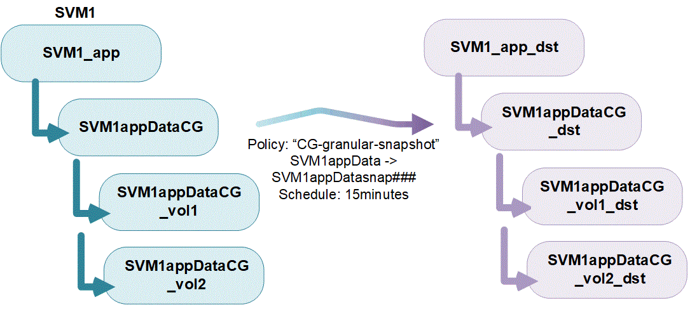

= 整合グループの概要
:icons: font
:imagesdir: ../media/

[role="lead"]
整合グループは、複数のボリュームにまたがるアプリケーションワークロードに対して書き込み順序の整合性保証を提供するボリュームの集まりです。

整合グループを使用すると、アプリケーションのワークロードを簡単に管理でき、ローカルとリモートの保護ポリシーを簡単に管理できます。また、一度に複数のボリュームについて、 crash-consistent Snapshot コピーとアプリケーションと整合性のある Snapshot コピーを同時に提供できます。整合グループ内の Snapshot を使用すると、アプリケーションのワークロード全体をリストアできます。

整合グループは、プロトコル（ NAS 、 SAN 、 NVMe ）に関係なく任意の FlexVol をサポートし、 ONTAP REST API または * Storage > Consistency Groups * メニュー項目で System Manager から管理できます。

整合グループは、独自のグループにすることも、階層型の関係にすることもできます。個々の整合グループは、ボリュームの集まりです。ボリュームには、整合グループから Snapshot ポリシーを継承するだけでなく、個々のローカル Snapshot ポリシーを設定できます。整合グループに適用できる SM-BC 関係は 1 つだけで、 SM-BC ポリシーを共有することもできます。このポリシーを使用して整合グループ全体をリカバリすることもできます。

アプリケーションワークロードが大きいほど、複数の整合グループが必要になる場合がありますこのような状況では、複数の整合グループを 1 つの階層関係にまとめることができます。この構成では、単一の整合グループが親整合グループの子コンポーネントになります。親整合グループには、最大 5 つの子整合グループを含めることができます。個々の整合グループと同様に、リモートの SM-BC 保護ポリシーを整合グループの設定全体（親と子）に適用して、アプリケーションワークロードをリカバリすることができます。

image:../media/consistency-group-nested-diagram.gif["コンスティチュエントボリュームを含むネストされた整合グループの図"]

== 保護

整合グループは、 SnapMirror のビジネス継続性（ SM-BC ）を通じてリモート保護を提供し、 Snapshot ポリシーを通じてローカルで保護します。リモート保護を利用するには、の要件を満たす必要があります xref:../smbc/smbc_plan_prerequisites.html#licensing[SnapMirror によるビジネス継続性の導入]。デフォルトでは、整合性グループには保護ポリシーが設定されておらず、ポリシーが選択されていないかぎりデータは保護されません。を参照してください link:protect-task.html["「コンシステンシグループの保護」"] を参照してください。

== アップグレード時の考慮事項

ONTAP 9.8 および 9.9.1 の SM-BC で作成された整合グループは、 ONTAP 9.10.1 にアップグレードすると、 System Manager の * Storage > Consistency Groups * または ONTAP REST API で自動的にアップグレードされ、管理可能になります。アップグレードの詳細については、を参照してください link:../smbc/smbc_admin_upgrade_and_revert_considerations.html["SM-BC アップグレードおよびリバートに関する考慮事項"]。

ONTAP REST API で作成されたコンシステンシグループスナップショットは、 System Manager のコンシステンシグループインタフェースおよびコンシステンシグループ API エンドポイントを通じて管理できます。

ONTAPI コマンド「 cg-start 」および「 cg-commit 」で作成された Snapshot は、整合グループ Snapshot として認識されないため、 System Manager の整合グループインターフェイスまたは ONTAP API の整合グループエンドポイントで管理することはできません。

== 整合グループオブジェクトの制限

|===

| 整合グループ | 適用範囲 | 最小（ Minimum ） | 最大 

| 整合グループの数 | クラスタ | 0 | クラスタの最大ボリューム数と同じ 

| 親整合グループの数 | クラスタ | 0 | クラスタの最大ボリューム数と同じ 

| 個々の整合グループと親整合グループの数 | クラスタ | 0 | クラスタの最大ボリューム数と同じ 

| 整合グループ | クラスタの最大ボリューム数と同じ | 1. | 80 

| 親整合グループの子内のボリュームの数 | 親整合グループ | 1. | 80 

| 子整合性グループ内のボリュームの数 | 子整合グループ | 1. | 80 

| 親整合グループ内の子整合グループの数 | 親整合グループ | 1. | 5. 
|===
SM-BC を使用する場合は、を参照してください link:../smbc/smbc_plan_additional_restrictions_and_limitations.html#volumes["SM-BC の制限および制限事項"]。
