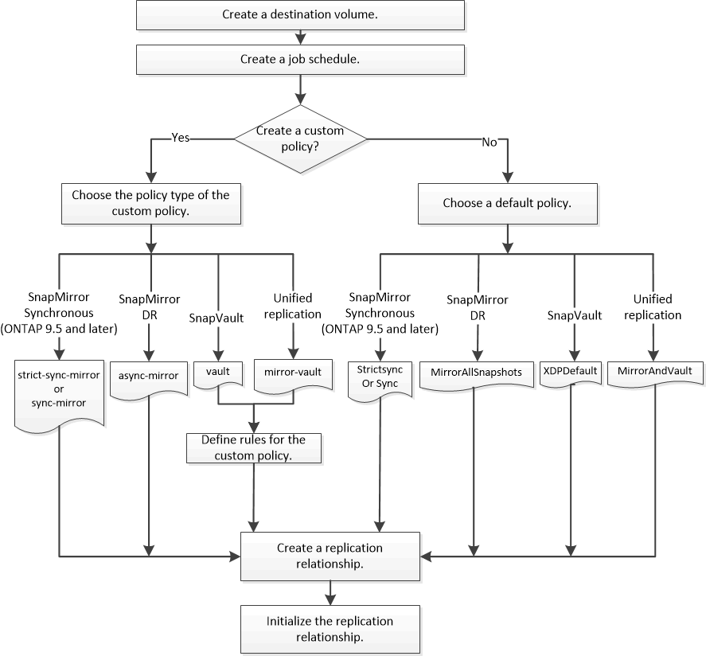

= SnapMirror レプリケーションのワークフロー
:allow-uri-read: 
:icons: font
:imagesdir: ../media/

[role="lead"]
SnapMirror には、 SnapMirror DR 、アーカイブ（旧 SnapVault ）、ユニファイドレプリケーションの 3 種類のデータ保護関係があります。各タイプの関係は、同じ基本的なワークフローに従って設定できます。

ONTAP 9.9.1の一般提供開始以降、SnapMirrorビジネス継続性（SM-BC）では、目標復旧時間ゼロ（ゼロRTO）または透過的アプリケーションフェイルオーバー（TAF）が提供され、SAN環境でビジネスクリティカルなアプリケーションを自動的にフェイルオーバーできます。SM-BC は、 2 つの AFF クラスタまたは 2 つの All SAN Array （ ASA ）クラスタの構成でサポートされます。

https://["ネットアップのマニュアル： SnapMirror Business Continuity"]

SnapMirror データ保護関係のタイプごとに、ワークフローは同じです。デスティネーションボリュームの作成、ジョブスケジュールの作成、ポリシーの指定、関係の作成と初期化を行います。

ONTAP 9.3以降では、を使用できます `snapmirror protect` コマンドを使用してデータ保護関係をワンステップで設定できます。を使用する場合でも同様です `snapmirror protect`では、ワークフローの各手順を理解しておく必要があります。

