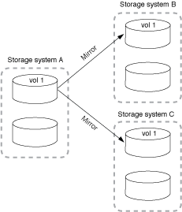

= ファンアウト構成およびカスケード構成のデータ保護
:allow-uri-read: 
:icons: font
:imagesdir: ../media/

[role="lead"]
a_fan-out_deployment を使用すると、データ保護を複数のセカンダリシステムに拡張できます。a_cascade _deployment を使用して、データ保護を 3 次システムに拡張できます。

ファンアウトとカスケードのどちらの構成でも、 SnapMirror DR 、 SnapVault 、ユニファイドレプリケーションを任意に組み合わせることができます。ただし、 SnapMirror Synchronous 関係（ ONTAP 9.5 以降でサポート）では非同期 SnapMirror 関係を使用したファンアウト構成のみがサポートされ、カスケード構成はサポートされません。ファンアウト構成で確立できる SnapMirror Synchronous 関係は 1 つだけで、ソースボリュームからの残りの関係はすべて非同期 SnapMirror 関係にする必要があります。 xref:../snapmirror-active-sync/recover-unplanned-failover-task.html[SnapMirrorアクティブ同期] （ONTAP 9.3.1以降でサポート）では、ファンアウト構成もサポートされます。

NOTE: ファンイン導入を使用すると、複数のプライマリシステムと単一のセカンダリシステムの間にデータ保護関係を作成できます。各関係では、セカンダリシステム上の異なるボリュームを使用する必要があります。

NOTE: ファンアウト構成またはカスケード構成に含まれるボリュームは、
再同期：SnapMirror関係のレポートが表示されることも珍しくありません。
長期間のステータス「準備中」。

== ファンアウト構成の仕組み

SnapMirror は、 _ multiple-mirrors _ および _ mirror -vault_fan-out 構成をサポートします。

複数ミラーファンアウト構成では、ソースボリュームから複数のセカンダリボリュームへのミラー関係が確立されます。

ミラー - ヴォールトファンアウト構成では、ソースボリュームからセカンダリボリュームへのミラー関係と、別のセカンダリボリュームへの SnapVault 関係が確立されます。

image::../media/sm-mirror-vault-fanout.png[データ保護の構成：ミラー - ヴォールトファンアウト]

ONTAP 9.5 以降では、ファンアウト構成で SnapMirror Synchronous 関係を確立できます。ただし、ファンアウト構成で確立できる SnapMirror Synchronous 関係は 1 つだけで、ソースボリュームからの残りの関係はすべて非同期 SnapMirror 関係にする必要があります。

image::../media/ssm-fanout.gif[データ保護構成：SnapMirror Synchronous関係を使用したファンアウト構成]

== カスケード構成の仕組み

SnapMirror は、 _ mirror - 、 _ mirror - vault_ 、 _vault - mirror_ 、 _vault-vault-cascade の構成をサポートしています。

ミラー - ミラーカスケード構成の関係のチェーンでは、ソースボリュームがセカンダリボリュームにミラーリングされ、そのセカンダリボリュームが 3 番目のボリュームにミラーリングされます。セカンダリボリュームが使用できなくなった場合は、プライマリボリュームと 3 番目のボリュームの間の関係を同期できます。ベースライン転送を新たに実行する必要はありません。

ONTAP 9.6 以降では、ミラー - ミラーカスケード構成で SnapMirror Synchronous 関係がサポートされます。SnapMirror Synchronous 関係に含めることができるのは、プライマリボリュームとセカンダリボリュームだけです。セカンダリボリュームと 3 番目のボリュームの関係は非同期でなければなりません。

image::../media/sm-mirror-mirror-cascade.png[SnapMirror の構成：ソースからのミラー - ミラーカスケードチェーン]

ミラー - ヴォールトカスケード構成の関係のチェーンでは、ソースボリュームがセカンダリボリュームにミラーリングされ、そのセカンダリボリュームが 3 番目のボリュームに保存されます。

image::../media/sm-mirror-vault-cascade.png[SnapMirror の構成：ソース - ミラー - ヴォールトカスケードチェーン]

ヴォールト - ミラー、 ONTAP 9.2 以降では、ヴォールト - ヴォールトカスケード構成もサポートされます。

* ヴォールト - ミラーカスケード構成の関係のチェーンでは、ソースボリュームがセカンダリボリュームに保存され、そのセカンダリボリュームが 3 番目のボリュームにミラーリングされます。
* （ ONTAP 9.2 以降）ヴォールト - ヴォールトカスケード構成の関係のチェーンでは、ソースボリュームがセカンダリボリュームに保存され、そのセカンダリボリュームが 3 番目のボリュームに保存されます。

.詳細はこちら
* xref:../snapmirror-active-sync/recover-unplanned-failover-task.html[SnapMirrorアクティブな同期を使用してファンアウト構成で保護を再開]

