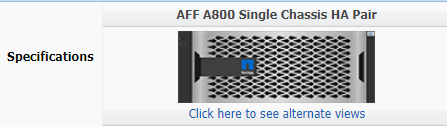

= ノードまたはシェルフにドライブを追加
:allow-uri-read: 
:icons: font

[role="lead"]
ホットスペアの数を増やしたり、ローカル階層（アグリゲート）にスペースを追加したりするには、ノードまたはシェルフにドライブを追加します。

.作業を開始する前に
追加するドライブがプラットフォームでサポートされている必要があります。次のコマンドを使用して確認できます。 link:https://hwu.netapp.com/["NetApp Hardware Universe の略"^]。

1 つの手順に追加する必要があるドライブは 6 本以上です。ドライブを 1 本追加するとパフォーマンスが低下する可能性があります。

.NetApp Hardware Universeの手順
. [** Products*]ドロップダウンメニューで、ハードウェア構成を選択します。
. プラットフォームを選択します。
. 実行しているONTAPのバージョンを選択し、**Show Results**を選択します。
. 図の下で、[**別のビューを表示するにはここをクリック*]を選択します。設定に一致するビューを選択します。

の画像]

.ドライブの取り付け手順
. を確認します link:https://mysupport.netapp.com/site/["NetApp Support Site"^] 新しいドライブファームウェアやシェルフファームウェア、Disk Qualification Packageファイルについては、を参照してください。
+
ノードまたはシェルフに最新バージョンがインストールされていない場合は、新しいドライブを取り付ける前に更新します。

+
最新のファームウェアバージョンがインストールされていない新しいドライブでは、ドライブファームウェアは自動的に（無停止で）更新されます。

. 自身の適切な接地対策を行います
. プラットフォームの前面からベゼルをそっと取り外します。
. 新しいドライブの正しいスロットを特定します。
+

NOTE: ドライブを追加するための正しいスロットは、プラットフォームのモデルと ONTAP のバージョンによって異なります。場合によっては、特定のスロットに順番にドライブを追加する必要があります。たとえば、 AFF A800 では、特定の間隔でドライブを追加し、クラスタに空のスロットが残っています。一方、 AFF A220 では、外からシェルフの中央に向かって実行されている次の空きスロットに新しいドライブを追加します。

+
使用する構成に適したスロットを特定するには、「**Before You Begin**」の手順を参照してください。 link:https://hwu.netapp.com/["NetApp Hardware Universe の略"^]。

. 新しいドライブを挿入します。
+
.. カムハンドルを開いた状態で、両手で新しいドライブを挿入します。
.. ドライブが停止するまで押します。
.. ドライブがミッドプレーンに完全に収まり、カチッという音がして固定されるまで、カムハンドルを閉じます。カムハンドルは、ドライブの前面に揃うようにゆっくりと閉じてください。

. ドライブのアクティビティ LED （緑色）が点灯していることを確認します。
+
ドライブのアクティビティ LED が点灯している場合は、ドライブに電力が供給されています。ドライブのアクティビティ LED が点滅しているときは、ドライブに電力が供給されていて、 I/O が実行中です。ドライブファームウェアが自動的に更新されている場合は、 LED が点滅します。

. 別のドライブを追加する場合は、手順 4~6 を繰り返します。
+
新しいドライブは、ノードに割り当てられるまで認識されません。新しいドライブを手動で割り当てることができます。また、ドライブの自動割り当てルールを適用しているノードの場合は、新しいドライブがONTAP によって自動的に割り当てられるまで待つこともできます。

. 新しいドライブがすべて認識されたら、ドライブが追加され、所有権が正しく指定されていることを確認します。

.インストールの確認手順
. ディスクのリストを表示します。
+
`storage aggregate show-spare-disks`

+
新しいドライブが正しいノードで所有されていることを確認してください。

. **必要に応じて（ONTAP 9.3以前の場合のみ）**新しく追加したドライブを初期化します。
+
`storage disk zerospares`

+
別のONTAP ローカル階層（アグリゲート）で以前使用されていたドライブは、アグリゲートに追加する前に初期化する必要があります。ONTAP 9.3以前では、ノード内の初期化されていないドライブのサイズによっては、初期化が完了するまでに数時間かかることがあります。この時点でドライブを初期化しておくと、ローカル階層のサイズをすぐに拡張する必要がある場合に時間を短縮できます。これはONTAP 9.4以降の問題 ではありません。ドライブは高速初期化を使用して初期化されますが、これには数秒しかかかりません。

.結果
新しいドライブの準備が完了しました。  ローカル階層（アグリゲート）に追加したり、ホットスペアのリストに配置したり、新しいローカル階層を作成したときに追加したりできます。
