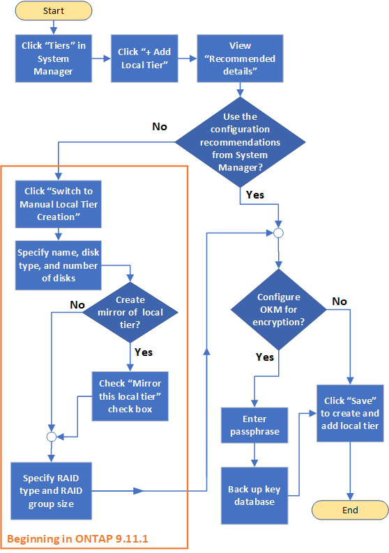

= ONTAPローカル階層を追加するワークフロー
:allow-uri-read: 
:icons: font
:imagesdir: ../media/

[role="lead"]
ローカル階層を作成すると、システム上のボリュームにストレージが提供されます。

NOTE: ONTAP 9.7より前のバージョンでは、ローカル階層を表すために_aggregate_という用語が使用されていました。ONTAPのバージョンに関係なく、ONTAP CLIでは_aggregate_という用語が使用されます。ローカル階層の詳細については、を参照してくださいlink:../disks-aggregates/index.html["ディスクとローカル階層"]。

ローカル階層を作成するワークフローは、使用するインターフェイス（System ManagerまたはCLI）に固有です。

[role="tabbed-block"]
====
.System Manager
--
ローカル階層の設定に関する推奨されるベストプラクティスに基づいて、System Managerでローカル階層が作成されます。

ONTAP 9 .11.1以降では、自動プロセスで推奨される設定とは別の設定を使用してローカル階層を手動で追加することもできます。

--
.CLI
--
ONTAP 9.2以降では、ONTAPでローカル階層の作成時に推奨される設定（自動プロビジョニング）を指定できます。ベストプラクティスに基づく推奨構成が環境に適している場合は、それらの構成を受け入れてローカル階層を作成できます。それ以外の場合は、ローカル階層を手動で作成できます。

image:aggregate-creation-workflow.gif["ローカル階層の作成ワークフロー"]

--
====