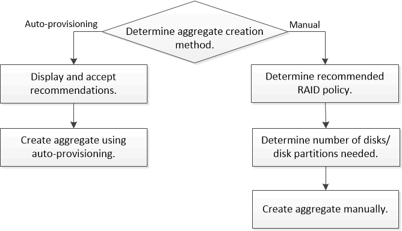

= ローカル階層（アグリゲート）を追加するワークフロー
:allow-uri-read: 
:icons: font
:imagesdir: ../media/

[role="lead"]
ローカル階層（アグリゲート）を作成すると、システム上のボリュームにストレージが提供されます。

ローカル階層（アグリゲート）を作成するワークフローは、使用するインターフェイスに固有のものです。System ManagerまたはCLIを使用します。

[role="tabbed-block"]
====
.System Managerのワークフロー
--
* System Managerを使用して、ローカル階層を追加（作成）*します

System Managerでは、ローカル階層を設定するための推奨されるベストプラクティスに基づいてローカル階層が作成されます。

ONTAP 9.11.1以降では、自動プロセスでローカル階層を追加する際に推奨される設定と異なる設定が必要な場合に、ローカル階層を手動で設定できます。

image:../media/workflow-add-create-local-tier.png["ローカル階層の作成ワークフロー"]

--
.CLIワークフロー
--
* CLIを使用して、アグリゲートを追加（作成）*します

ONTAP 9.2以降では、アグリゲートの作成時にONTAP の推奨構成を使用できます（自動プロビジョニング）。ベストプラクティスに基づいた推奨構成がご使用の環境に適している場合は、それらの構成を承認してアグリゲートを作成することもできます。アグリゲートを手動で作成することもできます。

--
====