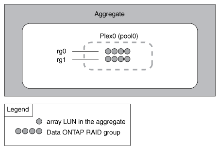

= ミラーされていないアグリゲートの機能
:icons: font
:imagesdir: ../media/

[role="lead"]
SyncMirror を使用している場合を除き、アグリゲートがミラーされることはありません。ミラーされていないアグリゲートには、プレックス _ （データのコピー）が 1 つだけ含まれ、アグリゲートに属するすべての RAID グループがこのアグリゲートに格納されます。

次の図に、 1 つのプレックスを含む、ディスクで構成されたミラーされていないアグリゲートを示します。アグリゲートには、 rg0 、 rg1 、 rg2 、 rg3 の 4 つの RAID グループがあります。各 RAID グループには 6 本のデータディスクがあり、パリティディスクと dparity （ダブルパリティ）ディスクが 1 本ずつ含まれます。アグリゲートで使用されるディスクは、すべて同じプール pool0 から割り当てられます。

image::../media/drw-plexum-scrn-en-noscale.gif[この図は上述の説明を表したものです。]

次の図に、 1 つのプレックスを含む、アレイ LUN で構成されたミラーされていないアグリゲートを示します。rg0 と rg1 の 2 つの RAID グループがあります。アグリゲートで使用されるアレイ LUN は、すべて同じプール pool0 から割り当てられます。

