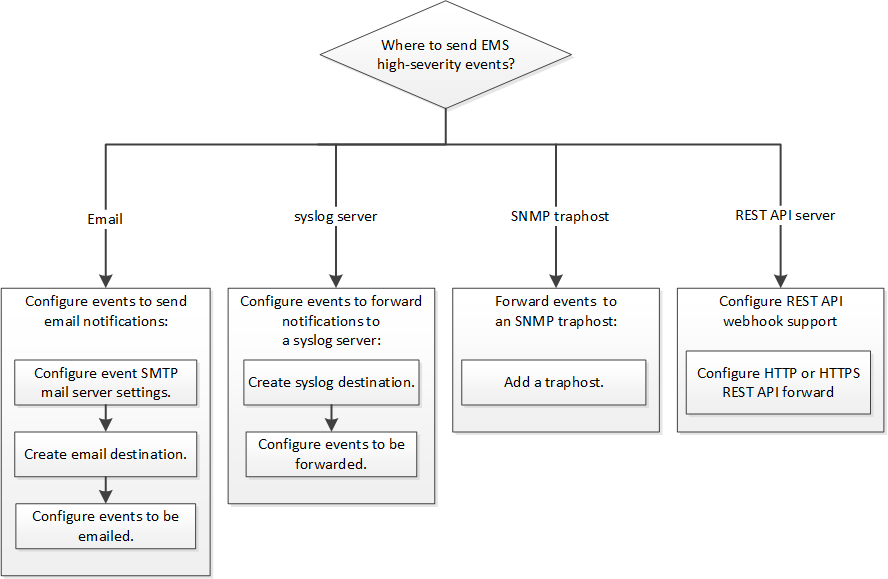

= EMS の設定ワークフロー
:allow-uri-read: 
:icons: font
:imagesdir: ../media/

[role="lead"]
重要なEMSイベント通知は、Eメールで送信されるか、syslogサーバに転送されるか、SNMPトラップホストに転送されるか、またはWebフックアプリケーションに転送されるように設定する必要があります。これにより、適切な修正措置を講じてシステムの停止を回避できます。

.このタスクについて
サーバやアプリケーションなどの他のシステムで記録されたイベントを集約するためにすでに syslog サーバを使用している場合は、ストレージシステムの重要なイベントの通知にもその syslog サーバを使用すると簡単です。

syslog サーバがまだない場合は、重要なイベントの通知に E メールを使用すると便利です。

イベント通知をすでに SNMP トラップホストに転送している場合は、そのトラップホストで重要なイベントについても監視できます。

.選択肢
* イベント通知を送信するように EMS を設定します。
+
|===

| 状況 | 参照先 

 a| 
EMS の重要なイベント通知を E メールアドレスに送信します
 a| 
xref:configure-ems-events-send-email-task.adoc[重要な EMS イベントの通知を E メールで送信するように設定します]

 a| 
EMS の重要なイベント通知を syslog サーバに転送します
 a| 
xref:configure-ems-events-notifications-syslog-task.adoc[重要な EMS イベントの通知を syslog サーバに転送するように設定します]

 a| 
EMS のイベント通知を SNMP トラップホストに転送する
 a| 
xref:configure-snmp-traphosts-event-notifications-task.adoc[SNMP トラップホストでイベント通知を受信するように設定します]

 a| 
EMSでイベント通知をwebhookアプリケーションに転送する場合
 a| 
xref:configure-webhooks-event-notifications-task.adoc[重要なEMSイベントについて、通知をWebフックアプリケーションに転送するように設定します]

|===

