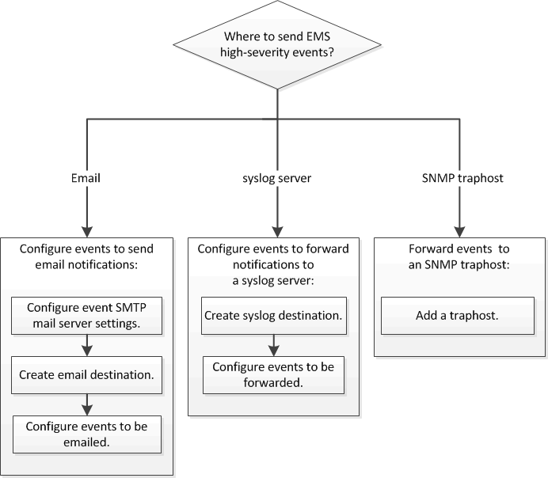

= EMS の設定ワークフロー
:icons: font
:imagesdir: ../media/

[role="lead"]
重要な EMS イベント通知は、 E メールで送信されるか、 syslog サーバに転送されるか、 SNMP トラップホストに転送されるか、または REST API サーバに転送されるように設定する必要があります。これにより、適切な修正措置を講じてシステムの停止を回避できます。

