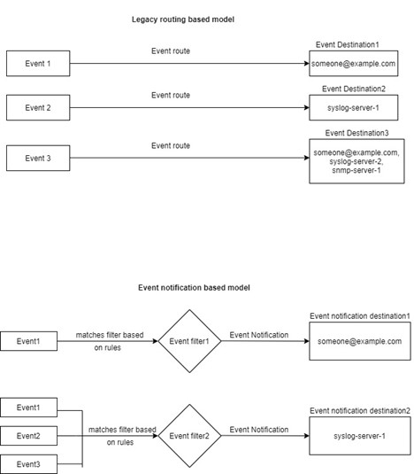

= EMS イベントのマッピングモデル
:allow-uri-read: 
:icons: font
:imagesdir: ../media/

[role="lead"]
ONTAP 9.0 よりも前のバージョンでは、 EMS イベントはイベント名のパターンマッチングに基づいてイベントデスティネーションにのみマッピングできました。ONTAP コマンドセット (`event destination`、 `event route`）は、最新バージョンのONTAP でも引き続きこのモデルを使用できますが、ONTAP 9.0以降では廃止されています。

ONTAP 9.0以降ではONTAP 、拡張性に優れたイベントフィルタモデルを使用して、を使用して複数のフィールドに対してパターンマッチングを実行することを推奨します `event filter`、 `event notification`および `event notification destination` コマンドセット。

廃止されたコマンドを使用してEMSマッピングが設定されている場合は、を使用するようにマッピングを更新する必要があります `event filter`、 `event notification`および `event notification destination` コマンドセット。

イベントの送信先には、次の 2 種類があります。

. * システムで生成される送信先 * ：システムで生成される 5 つのイベントの送信先があります（デフォルトで作成）。
+
** `allevents`
** `asup`
** `criticals`
** `pager`
** `traphost`
+
システムで生成される宛先の一部は、特別な目的に使用されます。たとえば、 ASUP デスティネーションは、 callhome.* イベントを ONTAP の AutoSupport モジュールにルーティングして AutoSupport メッセージを生成します。

. *ユーザが作成した送信先*：を使用して手動で作成します `event destination create` コマンドを実行します
+
[listing]
----
cluster-1::event*> destination show
                                                                 Hide
Name             Mail Dest.        SNMP Dest.         Syslog Dest.       Params
---------------- ----------------- ------------------ ------------------ ------
allevents        -                 -                  -                  false
asup             -                 -                  -                  false
criticals        -                 -                  -                  false
pager            -                 -                  -                  false
traphost         -                 -                  -                  false
5 entries were displayed.
+
cluster-1::event*> destination create -name test -mail test@xyz.com
This command is deprecated. Use the "event filter", "event notification destination" and "event notification" commands, instead.
+
cluster-1::event*> destination show
+                                                                     Hide
Name             Mail Dest.        SNMP Dest.         Syslog Dest.       Params
---------------- ----------------- ------------------ ------------------ ------
allevents        -                 -                  -                  false
asup             -                 -                  -                  false
criticals        -                 -                  -                  false
pager            -                 -                  -                  false
test             test@xyz.com      -                  -                  false
traphost         -                 -                  -                  false
6 entries were displayed.
----

廃止されたモデルでは、EMSイベントはを使用して個別にデスティネーションにマッピングされます `event route add-destinations` コマンドを実行します

[listing]
----
cluster-1::event*> route add-destinations -message-name raid.aggr.* -destinations test
This command is deprecated. Use the "event filter", "event notification destination" and "event notification" commands, instead.
4 entries were acted on.

cluster-1::event*> route show -message-name raid.aggr.*
                                                               Freq    Time
Message                          Severity       Destinations   Threshd Threshd
-------------------------------- -------------- -------------- ------- -------
raid.aggr.autoGrow.abort         NOTICE         test           0       0
raid.aggr.autoGrow.success       NOTICE         test           0       0
raid.aggr.lock.conflict          INFORMATIONAL  test           0       0
raid.aggr.log.CP.count           DEBUG          test           0       0
4 entries were displayed.
----
拡張性に優れた新しい EMS イベント通知メカニズムは、イベントフィルタとイベント通知の送信先に基づいています。新しいイベント通知メカニズムの詳細については、次の技術情報アーティクルを参照してください。

* link:https://kb.netapp.com/Advice_and_Troubleshooting/Data_Storage_Software/ONTAP_OS/FAQ%3A_Overview_of_Event_Management_System_for_ONTAP_9["ONTAP 9 のイベント管理システムの概要"^]

