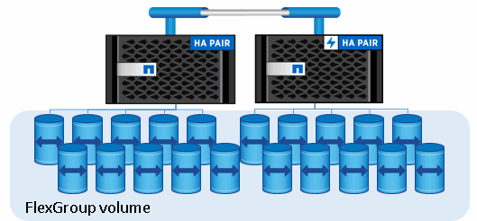

= FlexGroup ボリュームとは
:allow-uri-read: 
:icons: font
:imagesdir: ../media/

[role="lead"]
FlexGroup ボリュームは、ハイパフォーマンスと自動負荷分散を実現する、拡張性を備えたスケールアウト NAS コンテナです。FlexGroup ボリュームには、自動的かつ透過的にトラフィックを共有する複数のコンスティチュエントが含まれます。_constituents_は、FlexGroupボリュームを構成する基盤となるFlexVolボリュームです。

FlexGroup ボリュームには次の利点があります。

* 高い拡張性
+
ONTAP 9.1 以降では、 FlexGroup ボリュームの最大サイズは 20PB で、 10 ノードのクラスタにファイルを 4 、 000 億個まで格納できます。

* ハイパフォーマンス
+
FlexGroup ボリュームは、クラスタのリソースを利用してワークロードに対応することで高スループットと低レイテンシを実現します。

* 管理の簡易化
+
FlexGroup ボリュームは、 FlexVol と同様に管理できる単一のネームスペースコンテナです。

