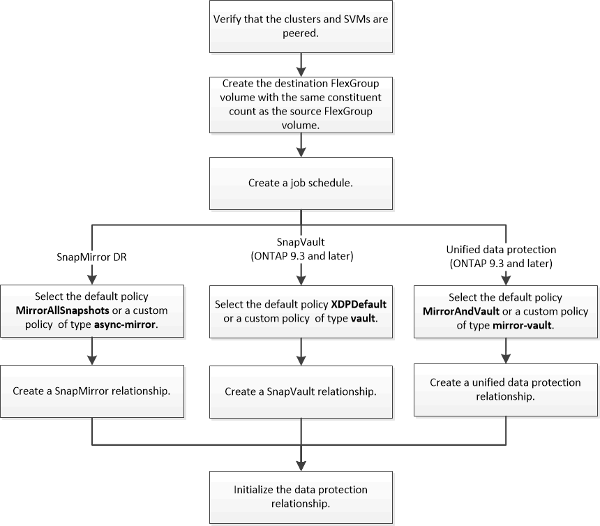

= FlexGroup ボリュームのデータ保護ワークフロー
:allow-uri-read: 
:icons: font
:imagesdir: ../media/

[role="lead"]
FlexGroup ボリュームの SnapMirror ディザスタリカバリ（ DR ）関係を作成できます。ONTAP 9.3 以降では、 SnapVault テクノロジを使用した FlexGroup のバックアップとリストアや、バックアップと DR に同じデスティネーションを使用する一元化されたデータ保護関係の作成も可能です。

データ保護ワークフローは、クラスタと SVM のピア関係の確認、デスティネーションボリュームの作成、ジョブスケジュールの作成、ポリシーの指定、データ保護関係の作成、関係の初期化で構成されます。

.このタスクについて
FlexGroup ボリュームの SnapMirror 関係のタイプは常に「 xdmp」 です。SnapMirror 関係によって提供されるデータ保護のタイプは、使用するレプリケーションポリシーで決まります。作成するレプリケーション関係に応じて、必要なタイプのデフォルトポリシーまたはカスタムポリシーを使用できます。次の表に、デフォルトポリシーのタイプとサポートされるカスタムポリシーのタイプをデータ保護関係のタイプ別に示します。

|===

| 関係タイプ | デフォルトポリシー | カスタムポリシータイプ 

 a| 
SnapMirror DR
 a| 
MirrorAllSnapshots
 a| 
非同期ミラー

 a| 
SnapVault バックアップ
 a| 
XDPDefault
 a| 
バックアップ

 a| 
一元化されたデータ保護
 a| 
MirrorAndVault の場合
 a| 
ミラー - バックアップ

|===
MirrorLatest ポリシーは FlexGroup ボリュームではサポートされません。
