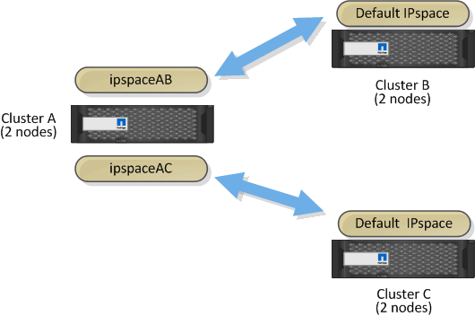

= カスタム IPspace を使用してレプリケーショントラフィックを分離します
:allow-uri-read: 
:icons: font
:imagesdir: ../media/

[role="lead"]
カスタム IPspace を使用すると、クラスタがそのピアに対して行ったやり取りを分離できます。Called_Designated intercluster connectivity_ 。この設定により、サービスプロバイダはマルチテナント環境でレプリケーショントラフィックを分離できます。

たとえば、クラスタ A とクラスタ B の間のレプリケーショントラフィックを、クラスタ A とクラスタ C の間のレプリケーショントラフィックから切り離すとしますこれを行うには、クラスタ A に IPspace を 2 つ作成します

一方の IPspace には、クラスタ B との通信に使用するクラスタ間 LIF が含まれています次の図に示すように、もう一方の IPspace には、クラスタ C との通信に使用するクラスタ間 LIF が含まれています。

カスタム IPspace の設定については、 _ ネットワーク管理ガイド _ を参照してください。
