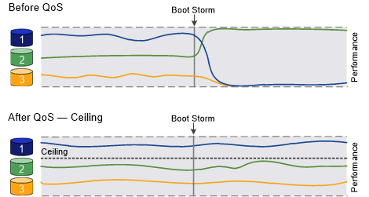

= QoS の概要を使用してスループットを保証
:allow-uri-read: 
:icons: font
:imagesdir: ../media/

[role="lead"]
ストレージサービス品質（ QoS ）を使用して、重要なワークロードのパフォーマンスが競合するワークロードの影響を受けて低下しないようにすることができます。競合するワークロードに Throughput Ceil天 を設定して、システムリソースへの影響を制限したり、重要なワークロードに Throughput Floor_ を設定したりすることで、競合するワークロードによる要求に関係なく最小のスループットターゲットを満たすことができます。同じワークロードに対して上限と下限を設定することもできます。

== スループットの上限（最大 QoS ）について

スループットの上限は、ワークロードのスループットを最大 IOPS / MBps 、または IOPS / MBps に制限します。次の図では、ワークロード 2 がワークロード 1 および 3 の Bully とならないようにスループットの上限が設定されています。

a_policy group_ は、 1 つ以上のワークロードに対するスループットの上限を定義します。ワークロードとは、 a_storage オブジェクト： _a ボリューム、ファイル、 qtree 、または LUN 、あるいは SVM 内のすべてのボリューム、ファイル、 qtree 、または LUN の I/O 処理のことです。上限はポリシーグループの作成時に指定できるほか、ワークロードをしばらく監視したあとで指定することもできます。

[NOTE]
====
ワークロードのスループットは、特にスループットが急激に変化した場合、指定された上限を 10% までは超過することができます。バースト時には、上限を 50% まで超過することができます。バーストは、トークンが 150% まで累積した場合に単一ノードで発生します

====

== スループットの下限（最小 QoS ）について

スループットの下限はワークロードのスループットが最小 IOPS / MBps / IOPS / MBps を下回らないことを保証します。次の図では、ワークロード 1 とワークロード 3 のスループットの下限により、ワークロード 2 による要求に関係なく、最小スループットの目標を達成しています。

[TIP]
====
これらの例からわかるように、スループットの上限はスループットを直接調整するのに対し、スループットの下限は下限が設定されたワークロードを優先することでスループットを間接的に調整します。

====
スループットの下限を定義するポリシーグループは、 SVM には適用できません。下限はポリシーグループの作成時に指定できるほか、ワークロードをしばらく監視したあとで指定することもできます。

[NOTE]
====
ONTAP 9.7 より前のリリースでは、使用可能なパフォーマンス容量が十分にある場合にスループットの下限が保証されます。ONTAP 9.7 以降では、使用可能なパフォーマンス容量が不足している場合でもスループットの下限を保証できます。この新しいフロアビヘイビアをフロア v2 と呼びます。この保証を満たすために、 v2 のフロアを使用すると、スループットの下限や下限の設定を超える作業を行わなくても、ワークロードのレイテンシが高くなる可能性があります。QoS とアダプティブ QoS の両方をサポートするフロア v2 環境。ONTAP 9.7P6 以降では、フロア v2 の新しい動作を有効または無効にするオプションを使用できます。「ボリューム移動トリガーカットオーバー」のような重要な操作の間は、ワークロードが指定されたフロアを下回ることがあります。利用可能な容量が十分にあり、重要な処理が実行されていない場合でも、ワークロードのスループットは指定された下限を 5% まで下回ることができます。オーバープロビジョニングされたフロアやパフォーマンス容量がないワークロードがある場合、指定された下限を下回ることがあります。

====
image::../media/qos-floor.gif[QoS の下限]

== 共有および非共有の QoS ポリシーグループについて

ONTAP 9.4 以降では、 _non-shared_QoS ポリシーグループを使用して、定義されたスループットの上限または下限の環境を各メンバーのワークロードごとに指定できます。_shared_policy グループの動作は ' ポリシー・タイプによって異なります

* スループットの上限については、共有ポリシーグループに割り当てられたワークロードの合計スループットが指定した上限以下でなければなりません。
* スループットの下限については、共有ポリシーグループを適用できるのは単一のワークロードのみです。

== アダプティブ QoS について

通常、ストレージオブジェクトに割り当てたポリシーグループの値は固定値です。ストレージオブジェクトのサイズが変わったときは、値を手動で変更する必要があります。たとえば、ボリュームの使用スペースが増えた場合、通常は指定されているスループットの上限も増やす必要があります。

アダプティブ QoS _ ワークロードのサイズの変更に合わせてポリシーグループの値が自動的に調整され、 TB または GB あたりの IOPS が一定に維持されます。これは、何百何千という数のワークロードを管理する大規模な環境では大きなメリットです。

アダプティブ QoS は、主にスループットの上限の調整に使用しますが、下限の管理（ワークロードサイズが増えた場合）に使用することもできます。ワークロードのサイズは、ストレージオブジェクトに割り当てられたスペースまたはストレージオブジェクトで使用されているスペースのいずれかで表されます。

[NOTE]
====
ONTAP 9.5 以降では、使用済みスペースをスループットの下限に使用できます。ONTAP 9.4 以前では使用できません。

====
* 割り当て済みスペースのポリシーでは、ストレージオブジェクトの公称サイズを基準に IOPS と TB / GB の比率が維持されます。比率が 100 IOPS/GB の場合、 150GB のボリュームのスループットの上限はボリュームのサイズが変更されないかぎり 15 、 000 IOPS です。ボリュームのサイズが 300GB に変更されると、アダプティブ QoS によってスループットの上限が 30 、 000 IOPS に調整されます。
* a_used space-policy （デフォルト）は、ストレージ効率化前に格納されている実際のデータの量に基づいて、 IOPS/TB|GB の比率を維持します。比率が 100 IOPS/GB の場合、 100GB のデータが格納された 150GB のボリュームのスループットの上限は 10 、 000 IOPS です。使用済みスペースの量が変わると、アダプティブ QoS によって比率が一定になるようにスループットの上限が調整されます。

ONTAP 9.5 以降では、アプリケーションに I/O ブロックサイズを指定することで、スループット制限を IOPS と MBps の両方で指定できます。MBps の制限は、ブロックサイズに IOPS 制限を掛けて計算されます。たとえば、 32K の I/O ブロックサイズで IOPS の制限が 6144 IOPS/TB の場合、 MBps の制限は 192MBps になります。

以下は、スループットの上限と下限の両方に対して想定される動作です。

* アダプティブ QoS ポリシーグループにワークロードを割り当てると、上限または下限がただちに更新されます。
* アダプティブ QoS ポリシーグループに含まれるワークロードのサイズを変更すると、上限または下限が約 5 分で更新されます。

更新が実行されるためにはスループットが少なくとも 10 IOPS 増加する必要があります。

アダプティブ QoS ポリシーグループは常に非共有です。定義されているスループットの上限または下限の環境各メンバーワークロードを個別に定義します。

ONTAP 9.6 以降では、 SSD を使用する ONTAP Select Premium でスループットの下限がサポートされます。

== 一般的なサポート

次の表に、スループットの上限、スループットの下限、およびアダプティブ QoS のサポート状況を示します。

|===

| リソースまたは機能 | スループットの上限 | スループットの下限 | スループットの下限 v2 | アダプティブ QoS 

 a| 
ONTAP 9 バージョン
 a| 
すべて
 a| 
9.2 以降
 a| 
9.7 以降
 a| 
9.3 以降

 a| 
プラットフォーム
 a| 
すべて
 a| 
* AFF
* C190 *
* ONTAP Select プレミアム SSD *

 a| 
* AFF
* C190
* SSD を使用する ONTAP Select Premium

 a| 
すべて

 a| 
プロトコル
 a| 
すべて
 a| 
すべて
 a| 
すべて
 a| 
すべて

 a| 
FabricPool
 a| 
はい。
 a| 
階層化ポリシーが「 none 」に設定され、ブロックがクラウドにない場合は「 Yes 」です。
 a| 
階層化ポリシーが「 none 」に設定され、ブロックがクラウドにない場合は「 Yes 」です。
 a| 
はい。

 a| 
SnapMirror Synchronous
 a| 
はい。
 a| 
いいえ
 a| 
いいえ
 a| 
はい。

|===
* C190 と ONTAP Select のサポートは、 ONTAP 9.6 リリースから開始されました。

== スループットの上限がサポートされるワークロード

次の表に、スループットの上限がサポートされるワークロードを ONTAP 9 のバージョン別に示します。ルートボリューム、負荷共有ミラー、およびデータ保護ミラーはサポートされません。

|===

| ワークロード - 上限 | 9.0 | 9.1 | 9.2 | 9.3 | 9.4 以降 | 9.8 以降 

 a| 
ボリューム
 a| 
はい。
 a| 
はい。
 a| 
はい。
 a| 
はい。
 a| 
はい。
 a| 
はい。

 a| 
ファイル。
 a| 
はい。
 a| 
はい。
 a| 
はい。
 a| 
はい。
 a| 
はい。
 a| 
はい。

 a| 
LUN
 a| 
はい。
 a| 
はい。
 a| 
はい。
 a| 
はい。
 a| 
はい。
 a| 
はい。

 a| 
SVM
 a| 
はい。
 a| 
はい。
 a| 
はい。
 a| 
はい。
 a| 
はい。
 a| 
はい。

 a| 
FlexGroup ボリューム
 a| 
いいえ
 a| 
いいえ
 a| 
いいえ
 a| 
はい。
 a| 
はい。
 a| 
はい。

 a| 
qtree *
 a| 
いいえ
 a| 
いいえ
 a| 
いいえ
 a| 
いいえ
 a| 
いいえ
 a| 
はい。

 a| 
ポリシーグループごとに複数のワークロードが割り当てられます
 a| 
はい。
 a| 
はい。
 a| 
はい。
 a| 
はい。
 a| 
はい。
 a| 
はい。

 a| 
非共有のポリシーグループ
 a| 
いいえ
 a| 
いいえ
 a| 
いいえ
 a| 
いいえ
 a| 
はい。
 a| 
はい。

|===
* ONTAP 9.8 以降では、 NFS が有効な FlexVol および FlexGroup ボリュームの qtree で NFS アクセスがサポートされます。ONTAP 9.9..1 以降では、 SMB が有効になっている FlexVol および FlexGroup ボリュームの qtree でも SMB アクセスがサポートされます。

== スループットの下限がサポートされるワークロード

次の表に、スループットの下限がサポートされるワークロードを ONTAP 9 のバージョン別に示します。ルートボリューム、負荷共有ミラー、およびデータ保護ミラーはサポートされません。

|===

| ワークロード - 下限 | 9.2 | 9.3 | 9.4 以降 | 9.8 以降 

 a| 
ボリューム
 a| 
はい。
 a| 
はい。
 a| 
はい。
 a| 
はい。

 a| 
ファイル。
 a| 
いいえ
 a| 
はい。
 a| 
はい。
 a| 
はい。

 a| 
LUN
 a| 
はい。
 a| 
はい。
 a| 
はい。
 a| 
はい。

 a| 
SVM
 a| 
いいえ
 a| 
いいえ
 a| 
いいえ
 a| 
いいえ

 a| 
FlexGroup ボリューム
 a| 
いいえ
 a| 
いいえ
 a| 
はい。
 a| 
はい。

 a| 
qtree *
 a| 
いいえ
 a| 
いいえ
 a| 
いいえ
 a| 
はい。

 a| 
ポリシーグループごとに複数のワークロードが割り当てられます
 a| 
いいえ
 a| 
いいえ
 a| 
はい。
 a| 
はい。

 a| 
非共有のポリシーグループ
 a| 
いいえ
 a| 
いいえ
 a| 
はい。
 a| 
はい。

|===
* ONTAP 9.8 以降では、 NFS が有効な FlexVol および FlexGroup ボリュームの qtree で NFS アクセスがサポートされます。ONTAP 9.9..1 以降では、 SMB が有効になっている FlexVol および FlexGroup ボリュームの qtree でも SMB アクセスがサポートされます。

== アダプティブ QoS がサポートされるワークロード

次の表に、アダプティブ QoS がサポートされるワークロードを ONTAP 9 のバージョン別に示します。ルートボリューム、負荷共有ミラー、およびデータ保護ミラーはサポートされません。

|===

| ワークロード - アダプティブ QoS | 9.3 | 9.4 以降 

 a| 
ボリューム
 a| 
はい。
 a| 
はい。

 a| 
ファイル。
 a| 
いいえ
 a| 
はい。

 a| 
LUN
 a| 
いいえ
 a| 
はい。

 a| 
SVM
 a| 
いいえ
 a| 
いいえ

 a| 
FlexGroup ボリューム
 a| 
いいえ
 a| 
はい。

 a| 
ポリシーグループごとに複数のワークロードが割り当てられます
 a| 
はい。
 a| 
はい。

 a| 
非共有のポリシーグループ
 a| 
はい。
 a| 
はい。

|===

== ワークロードとポリシーグループの最大数

次の表に、ワークロードとポリシーグループの最大数を ONTAP 9 のバージョン別に示します。

|===

| ワークロードのサポート | 9.3 以前 | 9.4 以降 

 a| 
クラスタあたりの最大ワークロード
 a| 
12,000
 a| 
40,000

 a| 
ノードあたりの最大ワークロード
 a| 
12,000
 a| 
40,000

 a| 
ポリシーグループの最大数
 a| 
12,000
 a| 
12,000

|===