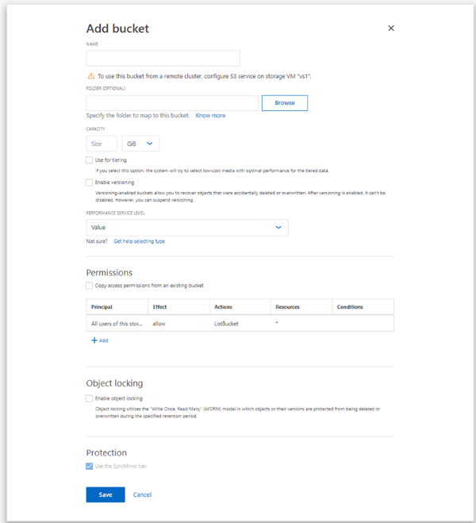

= MetroCluster構成のミラーされたアグリゲートまたはミラーされていないアグリゲートにバケットを作成する
:allow-uri-read: 
:icons: font
:imagesdir: ../media/

[role="lead"]
ONTAP 9.14.1以降では、MetroCluster FC構成およびIP構成のミラーされたアグリゲートまたはミラーされていないアグリゲートにバケットをプロビジョニングできます。

.タスクの内容
* デフォルトでは、バケットはミラーされたアグリゲート上にプロビジョニングされます。
* MetroCluster環境でバケットを作成する場合も、で説明したのと同じプロビジョニングガイドラインがlink:create-bucket-task.html["バケットを作成する"]適用されます。
* MetroCluster環境では、S3オブジェクトストレージの次の機能は*サポートされません*。
+
** SnapMirror S3
** S3バケットのライフサイクル管理
** Compliance *モードでのS3オブジェクトのロック
+

NOTE: *ガバナンス*モードでのS3オブジェクトのロックがサポートされています。

** ローカルFabricPool階層化

.開始する前に
S3サーバを含むSVMがすでに存在している必要があります。

== バケットを作成するプロセス

[role="tabbed-block"]
====
.CLI
--
. アグリゲートとFlexGroupコンポーネントを自分で選択する場合は、権限レベルをadvancedに設定します（それ以外の場合はadmin権限レベルで十分です）。 `set -privilege advanced`
. バケットを作成します。
+
`vserver object-store-server bucket create -vserver <svm_name> -bucket <bucket_name> [-size integer[KB|MB|GB|TB|PB]] [-use-mirrored-aggregates true/false]`

+
ミラーされたアグリゲートとミラーされていないアグリゲートのどちらを使用するかに応じて、オプションをまたは `false`に `true`設定し `-use-mirrored-aggregates`ます。

+

NOTE: デフォルトでは、この `-use-mirrored-aggregates`オプションはに設定されて `true`います。

+
** SVM名はデータSVMである必要があります。
** オプションを指定しない場合、800GBのバケットが作成され、システムで使用可能な最上位のサービス レベルが設定されます。
** パフォーマンスまたは使用量に基づいてバケットを作成する場合は、次のいずれかのオプションを使用します。
+
*** サービスレベル
+
オプションに `-storage-service-level`、 `performance`、またはの `extreme`いずれかの値を指定します `value`。

*** 階層化
+
オプションを含め `-used-as-capacity-tier true`ます。

** 基盤となるFlexGroupボリュームを作成するアグリゲートを指定する場合は、次のオプションを使用します。
+
*** パラメータは `-aggr-list`、FlexGroupボリュームのコンスティチュエントに使用するアグリゲートのリストを指定します。
+
リスト内の各エントリによって、指定したアグリゲート上にコンスティチュエントが1つ作成されます。同じアグリゲートを複数回指定すると、そのアグリゲート上に複数のコンスティチュエントを作成できます。

+
FlexGroupボリューム全体で一貫したパフォーマンスが得られるように、ディスク タイプとRAIDグループ構成をすべてのアグリゲートで同じにする必要があります。

*** パラメータは `-aggr-list-multiplier`、FlexGroupボリュームの作成時にパラメータで指定したアグリゲートを繰り返し実行する回数を指定します `-aggr-list`。
+
パラメータのデフォルト値 `-aggr-list-multiplier`は4です。

. 必要に応じてQoSポリシーグループを追加します。
+
`vserver object-store-server bucket modify -bucket _bucket_name_ -qos-policy-group _qos_policy_group_`

. バケットの作成を確認します。
+
`vserver object-store-server bucket show [-instance]`

.例
次の例では、ミラーされたアグリゲート上に1TBのSVM vs1のバケットを作成します。

[listing]
----
cluster-1::*> vserver object-store-server bucket create -vserver svm1.example.com -bucket testbucket  -size 1TB -use-mirrored-aggregates true
----
--
.System Manager
--
. S3対応Storage VMに新しいバケットを追加する。
+
.. [ * ストレージ ] 、 [ バケット ] の順にクリックし、 [ * 追加 ] をクリックします。
.. 名前を入力し、Storage VMを選択してサイズを入力します。
+
デフォルトでは、バケットはミラーされたアグリゲートにプロビジョニングされます。ミラーされていないアグリゲートにバケットを作成する場合は、*[その他のオプション]*を選択し、*[保護]*の*[ SyncMirror階層を使用する]*ボックスをオフにします（次の図を参照）。

+

+
*** この時点で * Save * をクリックすると、次のデフォルト設定でバケットが作成されます。
+
**** グループポリシーがすでに有効になっていないかぎり、バケットへのアクセスはユーザに許可されません。
+

NOTE: オブジェクトストレージへのアクセスが無制限になるため、S3 rootユーザを使用してONTAPオブジェクトストレージの管理と権限の共有を行わないでください。代わりに、管理Privilegesを割り当てたユーザまたはグループを作成します。

**** システムで使用可能な最高のサービス品質（パフォーマンス）レベル。

*** バケットの設定時にユーザの権限やパフォーマンスレベルを設定するには、「 * More Options * 」をクリックします。あとで設定を変更することもできます。
+
**** 権限を設定するために * More Options * を使用する前に、ユーザーとグループを作成しておく必要があります。
**** S3 オブジェクトストアを FabricPool の階層化に使用する場合は、パフォーマンスサービスレベルではなく、階層化に * 使用（階層化データのパフォーマンスが最適な低コストのメディアを使用）を選択することを検討してください。

. S3クライアントアプリケーション（別のONTAPシステムまたは外部のサードパーティアプリケーション）で、次のように入力して新しいバケットへのアクセスを確認します。
+
** S3サーバのCA証明書。
** ユーザのアクセスキーとシークレットキー。
** S3サーバのFQDN名とバケット名。

--
====