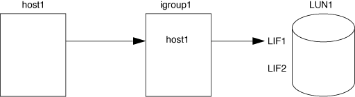

= ポートセットと igroup によって LUN アクセスを制限する方法
:icons: font
:imagesdir: ../media/

[role="lead"]
Selective LUN Map （ SLM ；選択的 LUN マップ）に加えて、 igroup およびポートセットを使用して LUN へのアクセスを制限することもできます。

ポートセットと SLM を併用すると、特定のターゲットのアクセスを特定のイニシエータのみに制限できます。SLM とポートセットを併用する場合、 LUN には、その LUN を所有するノードおよび HA パートナーのポートセットに含まれる一連の LIF 経由でアクセス可能になります。

次の例で、 initiator1 にはポートセットがありません。ポートセットがない場合、 initiator1 は LIF1 と LIF2 の両方を経由して LUN1 にアクセスできます。

ポートセットを使用すると、 LUN1 へのアクセスを制限できます。次の例では、 initiator1 は LIF1 経由でのみ LUN1 にアクセスできます。ただし、 LIF2 は portset1 に含まれないため、 LIF2 経由で LUN1 にアクセスすることはできません。

* 関連情報 *

* xref:selective-lun-map-concept.adoc[選択的 LUN マップ]
* xref:create-port-sets-binding-igroups-task.adoc[ポートセットを作成し、 igroup をポートセットにバインドします]

