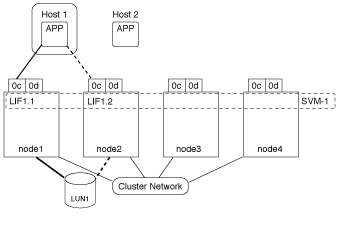
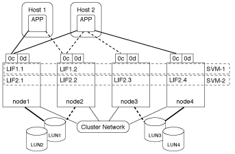

= 仮想環境での LUN へのアクセスの仕組み
:allow-uri-read: 
:icons: font
:imagesdir: ../media/

[role="lead"]
仮想環境では、ホスト（クライアント）は LIF を使用して、最適パスおよび非最適パス経由で LUN にアクセスします。

LIF は、 SVM を物理ポートに接続する論理インターフェイスです。複数の SVMs で同じポート上に複数の LIF を設定できますが、 1 つの LIF は 1 つの SVM に属します。LUN には、 SVM の LIF を介してアクセスできます。

次の例では、ホスト 1 が SVM-1 の LIF1.1 と LIF1.2 に接続して LUN1 にアクセスします。LIF1.1 は物理ポート node1 ： 0c を、 LIF1.2 は node2 ： 0c を使用します。LIF1.1 と LIF1.2 は SVM-1 のみに属しています。SVM-1 のノード 1 またはノード 2 で新しい LUN を作成した場合は、その LUN でもこれらの同じ LIF を使用できます。新しい SVM を作成した場合は、両方のノードの物理ポート 0c または 0d を使用して新しい LIF を作成できます。

1 つの物理ポートに複数の LIF を設定して、異なる SVM を接続できます。LIF は特定の SVM に関連付けられているため、クラスタノードは受信データトラフィックを正しい SVM に送信できます。次の例では、 1~4 の各ノードに、各ノードの物理ポート 0c を使用して SVM-2 用の LIF を 1 つずつ設定しています。ホスト 1 は SVM-1 の LIF1.1 と LIF1.2 に接続して LUN1 にアクセスします。ホスト 2 は、 SVM-2 の LIF2.1 と LIF2.2 に接続して LUN2 にアクセスします。両方の SVM がノード 1 とノード 2 の物理ポート 0c を共有しています。SVM-2 には追加の LIF があり、ホスト 2 はこの LIF を使用して LUN3 と LUN4 にアクセスします。これらの LIF はノード 3 とノード 4 の物理ポート 0c を使用します。複数の SVMs でそれらのノードの物理ポートを共有できます。

image::../media/bsag-c-mode-multiple-lifs-vservers.gif[2 台の SVM に対する node2 上の 2 個の LIF]

アクティブパスまたは最適パスでは、データトラフィックはクラスタネットワークを経由せずに、 LUN への最短ルートをとります。LUN1 へのアクティブパスまたは最適パスは、物理ポート 0c を使用してノード 1 の LUN1 1. を経由します。ホスト 2 には、アクティブパスまたは最適パスが 2 つあります。 1 つは node1 へのパスで、 LIF2.1 は物理ポート 0c を共有し、もう 1 つは node4 、 LIF2.4 は物理ポート 0c を使用します。

アクティブパスまたは非最適（間接）パスでは、データトラフィックはクラスタネットワークを経由します。この問題は、ホストからのアクティブパスまたは最適パスがすべて使用できず、トラフィックを処理できない場合にのみ発生します。ホスト 2 から SVM-2 LIF2.4 へのパスが失われた場合は、クラスタネットワークを経由して LUN3 と LUN4 にアクセスします。ホスト 2 からのアクセスには、ノード 3 の LIF2.3 が使用されます。トラフィックは、クラスタネットワークスイッチに入ったあと、 LUN3 と LUN4 にアクセスできるようノード 4 にバックアップされます。次に、クラスタネットワークスイッチ経由で逆方向に戻り、 LIF2.3 経由でホスト 2 にバックアウトされます。このアクティブパスまたは非最適パスは、 LIF2.4 へのパスがリストアされるか、ノード 4 のもう 1 つの物理ポートで SVM-2 の新しい LIF が確立されるまで使用されます。

image::../media/bsag-c-mode-optimized-path.gif[非最適パスの例]
