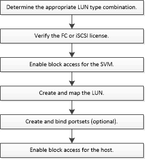

= LUN セットアップのワークフロー
:icons: font
:imagesdir: ../media/

[role="lead"]
LUN をセットアップするには、ニーズに最も適した LUN のタイプを特定する必要があります。次に、一連のタスクに従って、プロトコルのライセンスの確認、ブロックアクセスの有効化、 LUN の作成とマッピング、ホストでのブロックアクセスの有効化を行うことができます。オプションで、 LUN セットアップのワークフローの一環として、ポートセットを作成してバインドすることもできます。

