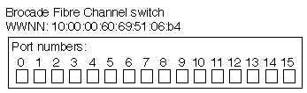

= FC を使用した SAN プロビジョニング
:allow-uri-read: 
:icons: font
:imagesdir: ../media/

[role="lead"]
ONTAP で FC SAN を実装する方法について理解する際に必要となる重要な概念について説明します。

== FC ターゲットノードをネットワークに接続する方法

ストレージシステムとホストはいずれもアダプタを備えており、ケーブルを使用して FC スイッチに接続できます。

ノードを FC SAN に接続すると、各 SVM の LIF の World Wide Port Name （ WWPN ；ワールドワイドポート名）がスイッチのファブリックネームサービスに登録されます。SVM の WWNN と各 LIF の WWPN は、 ONTAP によって自動的に割り当てられます。

[NOTE]
====
FC を使用してホストから直接ノードに接続することはできません。 NPIV が必要なため、スイッチを使用する必要があります。 iSCSI セッションでは、ネットワークルーティングされた接続または直接接続された接続で通信が可能です。ただし、どちらの方法も ONTAP でサポートされています。

====

== FC ノードの識別方法

FC を使用して設定された各 SVM は、 World Wide Node Name （ WWNN ）で識別されます。

== WWPN の使用方法

WWPN により、 FC をサポートするように設定されている SVM 内の各 LIF が識別されます。これらの LIF はクラスタ内の各ノードの物理 FC ポートを利用します。これらのポートには、 FC ターゲットカード、 UTA 、または UTA2 としてノードの FC または FCoE として設定することができます。

* igroup を作成します
+
ホストの HBA の WWPN は、 igroup の作成に使用します。igroup は、特定 LUN へのホストアクセスの制御に使用します。igroup を作成するには、 FC ネットワーク内の一連のイニシエータの WWPN を指定します。ストレージシステム上の LUN を igroup にマッピングすると、グループ内のすべてのイニシエータに対し、その LUN へのアクセスを許可することができます。LUN にマッピングされている igroup に WWPN が含まれていないホストは、その LUN にアクセスできません。つまり、そのホストでは、 LUN がディスクとして表示されません。

+
ポートセットを作成して、特定のターゲットポートでのみ LUN を表示することもできます。ポートセットは、 FC ターゲットポートをグループ化したものです。ポートセットには igroup をバインドできます。この igroup 内のすべてのホストは、ポートセット内のターゲットポートからのみ各 LUN にアクセスできます。

* FC LIF を一意に識別します
+
WWPN は、 FC 論理インターフェイスを一意に識別します。ホストの OS は、 WWNN と WWPN を組み合わせて使用して、 SVM および FC LIF を識別します。一部のオペレーティングシステムでは、パーシスタントバインディングがないと、ホスト上の同じターゲット ID に LUN が表示されません。

== WWN の割り当ての仕組み

WWN は、 ONTAP でシーケンシャルに作成されます。ただし、 ONTAP による割り当て方法が原因で、 WWN がシーケンシャルに割り当てられていないように見える場合があります。

各アダプタには WWPN および WWNN があらかじめ設定されていますが、 ONTAP ではあらかじめ設定された値が使用されません。その代わりに、 ONTAP はオンボードイーサネットポートの MAC アドレスに基づいて、固有の WWPN または WWNN を割り当てます。

WWN が割り当て時にシーケンシャルでないように見える理由は次のとおりです。

* WWN は、クラスタ内のすべてのノードと Storage Virtual Machine （ SVM ）で一意に割り当てられます。
* 解放された WWN はリサイクルされ、利用可能な名前のプールに再び追加されます。

== FC スイッチの識別方法

ファイバチャネルスイッチでは、デバイス自体に 1 つの Worldwide Node Name （ WWNN ；ワールドワイドノード名）があり、デバイスの各ポートに 1 つの Worldwide Port Name （ WWPN ；ワールドワイドポート名）があります。

たとえば、次の図は、 16 ポート Brocade スイッチの各ポートに WWPN がどのように割り当てられているかを示しています。特定のスイッチのポートの番号付けについては、そのスイッチ用にベンダーが提供するマニュアルを参照してください。

ポート* 0 *、WWPN 20：** 00 **：00：60：69：51：06：b4

ポート* 1 *、WWPN 20：** 01 **：00：60：69：51：06：b4

ポート * 14 * 、 WWPN 20 ： ** 0e ** 00 ： 60 ： 69 ： 51 ： 06 ： b4

ポート * 15 * 、 WWPN 20 ： ** 0f ** ： 00 ： 60 ： 69 ： 51 ： 06 ： B4
