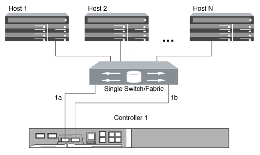

= シングルノードを使用する FC および FC-NVMe SAN ホストの構成方法
:allow-uri-read: 
:icons: font
:imagesdir: ../media/

[role="lead"]
シングルノードの FC および FC-NVMe SAN ホストは、 1 つ以上のファブリック経由で接続するように構成できます。N-Port ID Virtualization （ NPIV ； N ポート ID 仮想化）が必要で、ファブリック内のすべての FC スイッチで有効にする必要があります。FC または FC-NVMe SAN ホストを FC スイッチを使用せずにシングルノードに直接接続することはできません。

シングルノードの FC または FC-NVMe SAN ホストは、単一ファブリックまたはマルチファブリックを使用して構成できます。次の図の FC ターゲットポート（ 0a 、 0c 、 0b 、 0d ）は一例です。実際のポート番号は、使用しているストレージノードのモデル、および拡張アダプタを使用しているかどうかによって異なります。

== 単一ファブリックのシングルノード構成

単一ファブリックのシングルノード構成では、 1 つのノードを 1 台のスイッチで 1 つまたは複数のホストに接続します。スイッチが 1 台しかないため、この構成では完全な冗長性は確保されません。単一ファブリックのシングルノード構成は、 FC と FC-NVMe をサポートするすべてのハードウェアプラットフォームでサポートされます。ただし、 FAS2240 プラットフォームでは、単一ファブリックのシングルノード構成をサポートするために X1150A-R6 拡張アダプタが必要になります。

次の図は、 FAS2240 の単一ファブリックのシングルノード構成を示しています。これは FAS2240-2 の場合の例を示しており、ストレージコントローラは左右に並べて取り付けられます。FAS2240-4 では、コントローラは上下に並べて取り付けられます。どちらのモデルでも SAN の構成は同じです。

== マルチファブリックのシングルノード構成

マルチファブリックのシングルノード構成では、 1 つのノードを複数のスイッチで 1 つまたは複数のホストに接続します。次の図は、マルチファブリックのシングルノード構成を示しています。わかりやすいように、この図ではファブリックが 2 つだけになっていますが、マルチファブリック構成は 2 つ以上の任意の数のファブリックで構成できます。この図では、上のシャーシにストレージコントローラが取り付けられています。下のシャーシは、この例のように空けておくか、 IOMX モジュールを使用したりできます。

image::../media/scrn_en_drw_fc-62xx-multi-singlecontroller.png[マルチファブリックのシングルノード構成の図]

.関連情報
http://www.netapp.com/us/media/tr-4684.pdf["ネットアップテクニカルレポート 4684 ：『 Implementing and Configuring Modern SANs with NVMe/FC 』"]
