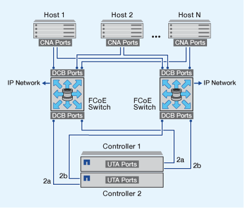

= FCoE の設定方法の概要
:icons: font
:imagesdir: ../media/

[role="lead"]
FCoE は、 FCoE スイッチを使用してさまざまな方法で構成できます。直接接続型の構成は FCoE ではサポートされません。

FCoE 構成はすべてデュアルファブリックです。完全な冗長性を提供し、ホスト側でマルチパスソフトウェアが必要です。すべての FCoE 構成で、イニシエータとターゲット間のパスには、最大ホップ数内であればいくつでも FCoE スイッチと FC スイッチを配置できます。スイッチ同士を接続するためには、イーサネット ISL をサポートするファームウェアバージョンがスイッチで実行されている必要があります。FCoE 構成の各ホストでオペレーティングシステムが同じである必要はありません。

FCoE 構成では、 FCoE の機能を明示的にサポートするイーサネットスイッチが必要です。FCoE 構成は、 FC スイッチと同じ相互運用性と品質管理プロセスに照らして検証されます。サポートされる構成の一覧については、 Interoperability Matrix を参照してください。これらのサポートされる構成には、スイッチモデル、単一ファブリックに導入可能なスイッチの数、サポートされるスイッチファームウェアのバージョンなどのパラメータが含まれています。

次の図の FC ターゲット拡張アダプタのポート番号は一例です。実際のポート番号は、 FCoE ターゲット拡張アダプタがインストールされている拡張スロットによって変わる場合があります。

== FCoE イニシエータから FC ターゲット

FCoE イニシエータ（ CNA ）を使用すると、 FCoE スイッチを介して、ホストを HA ペアの両方のコントローラの FC ターゲットポートに接続できます。FCoE スイッチには FC ポートも必要です。ホストの FCoE イニシエータは、常に FCoE スイッチに接続されます。FCoE スイッチは、 FC ターゲットに直接接続することも、 FC スイッチを介して FC ターゲットに接続することもできます。

次の図では、ホストの CNA を FCoE スイッチに接続し、 FC スイッチを HA ペアに接続しています。

image::../media/scrn-en-drw-fcoe-dual-2p-targ.gif[SCRN en drw FCoE デュアル 2p targ]

== FCoE イニシエータから FCoE ターゲット

ホストの FCoE イニシエータ（ CNA ）を使用すると、 FCoE スイッチを介して、ホストを HA ペアの両方のコントローラの FCoE ターゲットポート（ UTA または UTA2 とも呼ばれる）に接続できます。

== FCoE イニシエータから FCoE および FC ターゲット

ホストの FCoE イニシエータ（ CNA ）を使用すると、 FCoE スイッチを介して、ホストを HA ペアの両方のコントローラの FCoE および FC ターゲットポート（ UTA または UTA2 とも呼ばれる）に接続できます。

image::../media/scrn_en_drw_fcoe-mixed.png[SCRN en drw FCoE 混合]

== FCoE と IP ストレージプロトコルの混在

ホストの FCoE イニシエータ（ CNA ）を使用すると、 FCoE スイッチを介して、ホストを HA ペアの両方のコントローラの FCoE ターゲットポート（ UTA または UTA2 とも呼ばれる）に接続できます。FCoE ポートでは、単一のスイッチへの従来のリンクアグリゲーションは使用できません。Cisco スイッチは、 FCoE をサポートする特別なタイプのリンクアグリゲーション（仮想ポートチャネル）をサポートします。仮想ポートチャネルは、 2 つのスイッチへの個別のリンクを集約します。仮想ポートチャネルは他のイーサネットトラフィックにも使用できます。NFS 、 CIFS 、 iSCSI 、その他のイーサネットトラフィックなど、 FCoE 以外のトラフィックに使用するポートでは、 FCoE スイッチの通常のイーサネットポートを使用できます。

image::../media/scrn_en_drw_fcoe-mixed-ethernet.png[SCRN en drw FCoE 混合イーサネット]
