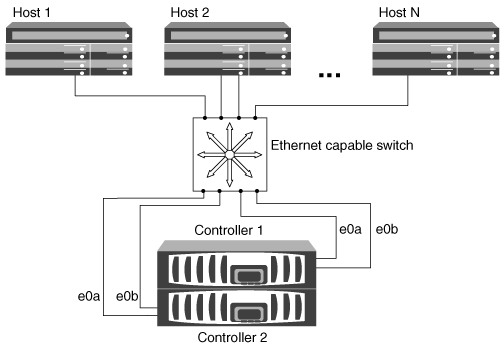

= HA ペアを使用する iSCSI SAN ホストの構成方法
:allow-uri-read: 
:icons: font
:imagesdir: ../media/

[role="lead"]
iSCSI SAN ホストは、 1 つまたは複数の IP スイッチを使用してデュアルノード構成またはマルチノード構成に接続するように構成できます。完全な冗長性が不要な場合はシングルスイッチ構成、完全な冗長性が必要な場合はマルチスイッチ構成を使用します。

iSCSI SAN ホストの構成にはシングルコントローラ構成と HA ペア構成があり、直接接続型、単一ネットワーク、またはマルチネットワークの環境で構成できます。HA ペアから複数の iSCSI 接続で各スイッチに接続できますが、この構成では各ホストに ALUA をサポートするマルチパスソフトウェアが必要になります。ホストが複数ある場合、各ホストでオペレーティングシステムが同じである必要はありません。詳細については、 NetApp Interoperability Matrix Tool を参照してください。

https://mysupport.netapp.com/matrix["NetApp Interoperability Matrix Tool で確認できます"^]

== 直接接続

直接接続型の構成では、 1 つ以上のホストをコントローラに直接接続します。

image::../media/dual-host-dual-controller.gif[直接接続の設定]

== 単一ネットワークの HA ペア

単一ネットワークの HA ペア構成では、 HA ペアを 1 台のスイッチで 1 つまたは複数のホストに接続します。スイッチが 1 台しかないため、この構成では完全な冗長性は確保されません。

== マルチネットワークの HA ペア

マルチネットワークの HA ペア構成では、 HA ペアを複数のスイッチで 1 つまたは複数のホストに接続します。スイッチが複数あるため、この構成では完全な冗長性が確保されます。

image::../media/scrn-en-drw-iscsi-dual.gif[マルチネットワークのHAペア構成]
