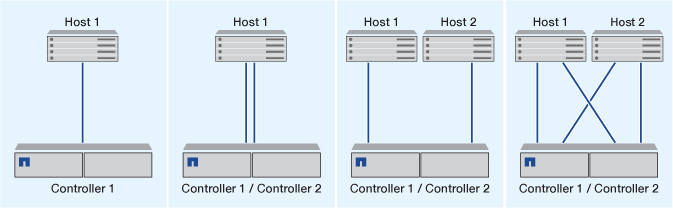

= iSCSI SANホストの構成方法
:allow-uri-read: 
:icons: font
:imagesdir: ../media/

[role="lead"]
iSCSI構成では、iSCSI SANホストに直接接続するか、1つ以上のIPスイッチを介してホストに接続するハイアベイラビリティ（HA）ペアを使用します。

link:../concepts/high-availability-pairs-concept.html["HA ペア"] ホストがLUNへのアクセスに使用するアクティブ/最適化パスとアクティブ/非最適パスのレポートノードとして定義されます。Windows、Linux、UNIXなど、異なるオペレーティングシステムを使用する複数のホストから同時にストレージにアクセスできます。  ホストでは、ALUAをサポートするサポート対象のマルチパス解決策がインストールおよび設定されている必要があります。サポートされるオペレーティングシステムとマルチパスソリューションは、 link:https://mysupport.netapp.com/matrix["NetApp Interoperability Matrix Tool で確認できます"^]。

マルチネットワーク構成では、ホストをストレージシステムに接続するスイッチが複数あります。  完全な冗長性を備えたマルチネットワーク構成を推奨します。  シングルネットワーク構成では、1台のスイッチでホストをストレージシステムに接続します。  シングルネットワーク構成では完全な冗長性は確保されません。

[NOTE]
====
link:../system-admin/single-node-clusters.html["シングルノードコウセイ"] は、フォールトトレランスやノンストップオペレーションのサポートに必要な冗長性が確保されないため、推奨されません。

====
.関連情報
* 詳細をご確認ください link:../san-admin/selective-lun-map-concept.html#determine-whether-slm-is-enabled-on-a-lun-map["選択的LUNマッピング（SLM）"] HAペアが所有するLUNへのアクセスに使用するパスを制限します。
* 詳細はこちら link:../san-admin/manage-lifs-all-san-protocols-concept.html["SAN LIF"]。
* の詳細を確認してください link:../san-config/benefits-vlans-iscsi-concept.html["iSCSIにおけるVLANの利点"]。

== マルチネツトワアクiSCSIコウセイ

マルチネットワークの HA ペア構成では、 HA ペアを複数のスイッチで 1 つまたは複数のホストに接続します。スイッチが複数あるため、この構成では完全な冗長性が確保されます。

image::../media/scrn-en-drw-iscsi-dual.png[マルチネットワークのHAペア構成]

== タンイチネツトワアクノiSCSIコウセイ

単一ネットワークの HA ペア構成では、 HA ペアを 1 台のスイッチで 1 つまたは複数のホストに接続します。スイッチが 1 台しかないため、この構成では完全な冗長性は確保されません。

image::../media/scrn-en-drw-iscsi-single.png[単一ネットワークのHAペア構成]

== 直接接続型iSCSI構成

直接接続型の構成では、 1 つ以上のホストをコントローラに直接接続します。

