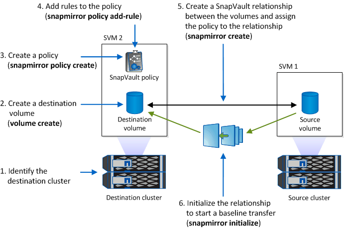

= Snapshot コピーを WORM 状態にコミット
:allow-uri-read: 
:icons: font
:imagesdir: ../media/

[role="lead"]
SnapLock for SnapVault を使用して、セカンダリストレージ上の Snapshot コピーを WORM 方式で保護できます。SnapLock デスティネーションでは、 SnapVault の基本的なタスクをすべて実行します。デスティネーションボリュームは自動的に読み取り専用でマウントされるため、 Snapshot コピーを WORM 状態に明示的にコミットする必要はありません。したがって、 SnapMirror ポリシーを使用してデスティネーションボリュームにスケジュールされた Snapshot コピーを作成することはできません。

.作業を開始する前に
* ソースクラスタで ONTAP 8.2.2 以降が実行されている必要があります。
* ソースアグリゲートとデスティネーションアグリゲートはどちらも 64 ビットである必要があります。
* ソースボリュームを SnapLock ボリュームにすることはできません。
* ピア SVM を含むピアクラスタにソースボリュームとデスティネーションボリュームを作成する必要があります。
+
詳細については、を参照してください link:https://docs.netapp.com/us-en/ontap-sm-classic/peering/index.html["クラスタピアリング"]。

* ボリュームの自動拡張が無効になっている場合は、デスティネーションボリュームに、ソースボリュームで使用されているスペースよりも少なくとも 5% 多い空きスペースが必要です。

ソースボリュームで使用するストレージは、ネットアップのストレージでもネットアップ以外のストレージでもかまいません。ネットアップ以外のストレージの場合は、 FlexArray 仮想化を使用する必要があります。

NOTE: WORM 状態にコミットされた Snapshot コピーの名前は変更できません。

SnapLock ボリュームはクローニングできますが、 SnapLock ボリューム上のファイルはクローニングできません。

NOTE: LUN は SnapLock ボリュームではサポートされていません。従来のテクノロジを使用して SnapLock ボリュームに LUN を移動することは可能ですが、サポートされている処理ではなく、 SnapLock ボリューム上の LUN に関するその他の処理も実行できません。

MetroCluster 構成の場合は、次の点に注意してください。

* SnapVault 関係は、同期元の SVM 間でのみ作成できます。同期元の SVM と同期先の SVM の間では作成できません。
* 同期元の SVM のボリュームからデータ提供用の SVM への SnapVault 関係を作成できます。
* データ提供用の SVM のボリュームから同期元の SVM の DP ボリュームへの SnapVault 関係を作成できます。

次の図は、 SnapVault 関係を初期化するための手順を示しています。

.手順
. デスティネーションクラスタを特定します。
. デスティネーションクラスタで、SnapLock ライセンスをインストールし、ComplianceClockを初期化します。9.10.1よりも前のONTAP リリースを使用している場合は、SnapLock アグリゲートを作成します。を参照してください xref:workflow-concept.html[SnapLock ワークフロー]。
. デスティネーションクラスタで、ソースボリュームと同じサイズ以上の「 D 」タイプの SnapLock デスティネーションボリュームを作成します。
+
`* volume create -vserver _svm_name _-volume _volume_name _-aggregate_aggregate_name _-snaplock-type compliance | enterprise-type-type dp-size_size_*」のようになります

+
[NOTE]
====
ONTAP 9.10.1 以降では、 SnapLock ボリュームと非 SnapLock ボリュームを同じアグリゲート上に配置できるため、 ONTAP 9.10.1 を使用している場合に別の SnapLock アグリゲートを作成する必要がなくなりました。ComplianceまたはEnterprise SnapLock のボリュームタイプを指定するには、volume-snaplock-typeオプションを使用します。ONTAP 9.10.1より前のONTAP リリースでは、SnapLock モードのComplianceモードまたはEnterpriseモードがアグリゲートから継承されます。バージョンに依存しないデスティネーションボリュームはサポートされません。デスティネーションボリュームの言語設定とソースボリュームの言語設定が一致している必要があります。

====
+
次のコマンドは、「 Node01_aggr 」アグリゲートの「 S VM2 」に「 d stvolB 」という名前の 2GB の SnapLock 「 Compliance 」ボリュームを作成します。

+
[listing]
----
cluster2::> volume create -vserver SVM2 -volume dstvolB -aggregate node01_aggr -snaplock-type compliance -type DP -size 2GB
----
. デスティネーションクラスタで、デフォルトの保持期間を設定します。手順については、を参照してください xref:set-default-retention-period-task.adoc[デフォルトの保持期間を設定]。
+
[NOTE]
====
バックアップデスティネーションである SnapLock には、デフォルトの保持期間が割り当てられます。この期間の値は、 SnapLock Enterprise ボリュームの場合は最初に 0 年以上、 SnapLock Compliance ボリュームの場合は 30 年以下に設定されます。各 NetApp Snapshot コピーは、最初にこのデフォルトの保持期間でコミットされます。保持期間は、必要に応じてあとから延長できます。詳細については、を参照してください xref:set-retention-period-task.adoc[保持期限の設定の概要を確認します]。

====
. xref:../data-protection/create-replication-relationship-task.adoc[新しいレプリケーション関係を作成] SnapLock 以外のソースと、手順 3 で作成した新しい SnapLock デスティネーションの間。
+
次の例では、「 XDPDefault 」というポリシーを使用して、デスティネーション SnapLock ボリューム「 stvolB 」との新しい SnapMirror 関係を作成します。これにより、 1 時間ごとのスケジュールで daily および weekly というラベルの Snapshot コピーをバックアップできます。

+
[listing]
----
cluster2::> snapmirror create -source-path SVM1:srcvolA -destination-path SVM2:dstvolB -vserver SVM2 -policy XDPDefault -schedule hourly
----
+
[NOTE]
====
xref:../data-protection/create-custom-replication-policy-concept.adoc[カスタムレプリケーションポリシーを作成する] または xref:../data-protection/create-replication-job-schedule-task.adoc[カスタムスケジュール] 使用可能なデフォルト設定が適切でない場合。

====
. デスティネーション SVM で、手順 5 で作成した SnapVault 関係を初期化します。
+
`* snapmirror initialize-ls-set -destination-path *`

+
次のコマンドは、「 VM1 」のソースボリューム「 rcvolA 」と「 `S VM2 」のデスティネーションボリューム「 d stvolB 」間の関係を初期化します。

+
[listing]
----
cluster2::> snapmirror initialize -destination-path SVM2:dstvolB
----
. 関係が初期化されてアイドル状態になったら、デスティネーションで「 snapshot-show 」コマンドを使用して、レプリケートされた Snapshot コピーに適用される SnapLock 有効期限を確認します。
+
次の例は、 SnapMirror ラベルと SnapLock の有効期限が設定されたボリューム「 stvolB 」上の Snapshot コピーを表示します。

+
[listing]
----
cluster2::> snapshot show -vserver SVM2 -volume dstvolB -fields snapmirror-label, snaplock-expiry-time
----

https://docs.netapp.com/us-en/ontap-sm-classic/peering/index.html["クラスタと SVM のピアリング"]

https://docs.netapp.com/us-en/ontap-sm-classic/volume-backup-snapvault/index.html["SnapVault を使用したボリュームのバックアップ"]
