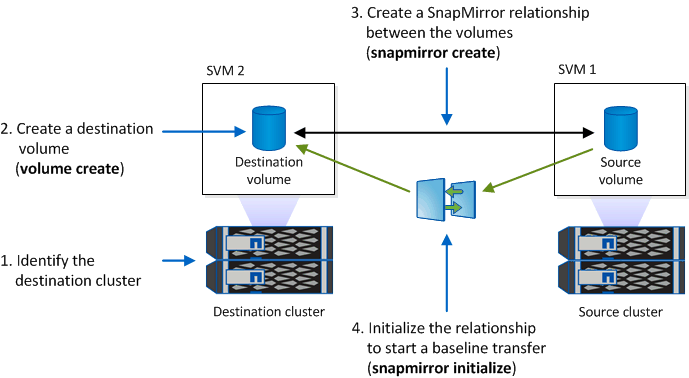

= ディザスタリカバリ用にWORMファイルをミラーリング
:allow-uri-read: 
:icons: font
:imagesdir: ../media/

[role="lead"]
SnapMirror を使用すると、ディザスタリカバリなどの目的で、地理的に離れた別の場所に WORM ファイルをレプリケートできます。ソースボリュームとデスティネーションボリュームの両方が SnapLock 用に設定されていて、両方のボリュームの SnapLock モードが Compliance または Enterprise である必要があります。ボリュームとファイルの主要な SnapLock プロパティがすべてレプリケートされます。

.前提条件
ピア SVM を含むピアクラスタにソースボリュームとデスティネーションボリュームを作成する必要があります。詳細については、を参照してください https://docs.netapp.com/us-en/ontap-sm-classic/peering/index.html["クラスタと SVM のピアリング"]。

.このタスクについて
* ONTAP 9.5 以降では、 WORM ファイルのレプリケーションに DP （データ保護）タイプの関係ではなく XDP （拡張データ保護）タイプの SnapMirror 関係を使用できます。XDP モードは ONTAP のバージョンに依存せず、同じブロックに格納されたファイルを区別できるため、レプリケートされた Compliance モードのボリュームの再同期が大幅に簡単になります。既存の DP タイプの関係を XDP タイプの関係に変換する方法については、を参照してください link:../data-protection/index.html["データ保護"]。
* Compliance モードのボリュームで DP タイプの SnapMirror 関係を再同期する場合、再同期によってデータが失われると SnapLock で判断されると処理は失敗します。再同期処理が失敗した場合は、を使用できます `volume clone create` デスティネーションボリュームのクローンを作成するコマンド。その後、ソースボリュームをクローンと再同期できます。
* SnapLock 対応ボリューム間の XDP タイプの SnapMirror 関係では、関係解除後にデスティネーションのデータがソースから変化していても再同期がサポートされます。
+
再同期時に共通の Snapshot に基づいてソースとデスティネーションの間でデータの相違が検出されると、この相違をキャプチャするためにデスティネーションで新しい Snapshot が作成されます。新しい Snapshot と共通の Snapshot の両方が次の期間ロックされます。

+
** デスティネーションのボリューム有効期限
** ボリューム有効期限が過ぎているか設定されていない場合、 Snapshot は 30 日間ロックされます
** デスティネーションにリーガルホールドが設定されている場合、実際のボリューム有効期限はマスクされて「無期限」と表示されますが、Snapshotは実際のボリューム有効期限内はロックされます。

デスティネーションボリュームの有効期限がソースよりもあとの場合、デスティネーションの有効期限が維持され、再同期後にソースボリュームの有効期限で上書きされることはありません。

デスティネーションにソースと異なるリーガルホールドが設定されている場合は、再同期を実行できません。再同期を試行する前に、ソースとデスティネーションに同じリーガルホールドを設定するか、またはデスティネーションのリーガルホールドをすべて解除する必要があります。

変更されたデータをキャプチャするためにデスティネーションボリュームで作成され、ロックされたSnapshotコピーは、のCLIを使用してソースにコピーできます `snapmirror update -s snapshot` コマンドを実行しますコピーした Snapshot はソースでもロックされたままです。

* SVM データ保護関係はサポートされません。
* 負荷共有データ保護関係はサポートされません。

次の図は、 SnapMirror 関係を初期化するための手順を示しています。

[role="tabbed-block"]
====
.System Manager の略
--
ONTAP 9.12.1以降では、System Managerを使用してWORMファイルのSnapMirrorレプリケーションを設定できます。

.手順
. [ストレージ]>[ボリューム]に移動します。
. *表示/非表示*をクリックし、* SnapLock タイプ*を選択して、*ボリューム*ウィンドウに列を表示します。
. SnapLock ボリュームを見つけます。
. をクリックします image:icon_kabob.gif["メニューオプション"] をクリックし、* Protect *を選択します。
. デスティネーションクラスタとデスティネーションStorage VMを選択してください。
. [ * その他のオプション * ] をクリックします。
. [Show legacy policies*]を選択し、[*DPDefault (legacy)*]を選択します。
. 「*接続先設定の詳細*」セクションで「*転送スケジュールの上書き」を選択し、「*時間単位*」を選択します。
. [ 保存（ Save ） ] をクリックします。
. ソースボリューム名の左側にある矢印をクリックしてボリュームの詳細を展開し、ページの右側でリモートSnapMirror保護の詳細を確認します。
. リモートクラスタで、「*保護関係*」に移動します。
. 関係を探し、デスティネーションボリューム名をクリックして関係の詳細を確認します。
. デスティネーションボリュームのSnapLock タイプおよびその他のSnapLock 情報を確認します。

--
.CLI の使用
--
. デスティネーションクラスタを特定します。
. デスティネーションクラスタで、 link:https://docs.netapp.com/us-en/ontap/system-admin/install-license-task.html["SnapLockライセンスをインストールする"]、 link:https://docs.netapp.com/us-en/ontap/snaplock/initialize-complianceclock-task.html["コンプライアンスクロックの初期化"]また、9.10.1より前のONTAPリリースを使用している場合は、 link:https://docs.netapp.com/us-en/ontap/snaplock/create-snaplock-aggregate-task.html["SnapLockアグリゲートを作成する"]。
. デスティネーションクラスタで、タイプがのSnapLock デスティネーションボリュームを作成します `DP` ソースボリュームと同じかそれ以上のサイズが指定されている必要があります。
+
`*volume create -vserver _SVM_name_ -volume _volume_name_ -aggregate _aggregate_name_ -snaplock-type compliance|enterprise -type DP -size _size_*`

+

NOTE: ONTAP 9.10.1 以降では、 SnapLock ボリュームと非 SnapLock ボリュームを同じアグリゲート上に配置できるため、 ONTAP 9.10.1 を使用している場合に別の SnapLock アグリゲートを作成する必要がなくなりました。ComplianceまたはEnterprise SnapLock のボリュームタイプを指定するには、volume-snaplock-typeオプションを使用します。ONTAP 9.10.1より前のONTAP リリースでは、SnapLock モード（ComplianceモードまたはEnterpriseモード）がアグリゲートから継承されます。バージョンに依存しないデスティネーションボリュームはサポートされません。デスティネーションボリュームの言語設定とソースボリュームの言語設定が一致している必要があります。

+
次のコマンドは、2GBのSnapLock を作成します `Compliance` という名前のボリューム `dstvolB` インチ `SVM2` アグリゲート `node01_aggr`：

+
[listing]
----
cluster2::> volume create -vserver SVM2 -volume dstvolB -aggregate node01_aggr -snaplock-type compliance -type DP -size 2GB
----
. デスティネーション SVM で、 SnapMirror ポリシーを作成します。
+
`*snapmirror policy create -vserver _SVM_name_ -policy _policy_name_*`

+
次のコマンドは、SVM全体のポリシーを作成します `SVM1-mirror`：

+
[listing]
----
SVM2::> snapmirror policy create -vserver SVM2 -policy SVM1-mirror
----
. デスティネーション SVM で、 SnapMirror スケジュールを作成します。
+
`*job schedule cron create -name _schedule_name_ -dayofweek _day_of_week_ -hour _hour_ -minute _minute_*`

+
次のコマンドは、という名前のSnapMirrorスケジュールを作成します `weekendcron`：

+
[listing]
----
SVM2::> job schedule cron create -name weekendcron -dayofweek "Saturday, Sunday" -hour 3 -minute 0
----
. デスティネーション SVM で、 SnapMirror 関係を作成します。
+
`*snapmirror create -source-path _source_path_ -destination-path _destination_path_ -type XDP|DP -policy _policy_name_ -schedule _schedule_name_*`

+
次のコマンドでは、ソースボリューム間にSnapMirror関係を作成します `srcvolA` オン `SVM1` デスティネーションボリュームを指定します `dstvolB` オン `SVM2`をクリックし、ポリシーを割り当てます `SVM1-mirror` スケジュールも `weekendcron`：

+
[listing]
----
SVM2::> snapmirror create -source-path SVM1:srcvolA -destination-path SVM2:dstvolB -type XDP -policy SVM1-mirror -schedule weekendcron
----
+

NOTE: XDP タイプは ONTAP 9.5 以降で使用できます。ONTAP 9.4 以前では DP タイプを使用する必要があります。

. デスティネーション SVM で、 SnapMirror 関係を初期化します。
+
`*snapmirror initialize -destination-path _destination_path_*`

+
初期化プロセスでは、デスティネーションボリュームへの _ ベースライン転送 _ が実行されます。SnapMirror はソースボリュームの Snapshot コピーを作成して、そのコピーおよびコピーが参照するすべてのデータブロックをデスティネーションボリュームに転送します。また、ソースボリューム上の他の Snapshot コピーもすべてデスティネーションボリュームに転送します。

+
次のコマンドは、ソースボリューム間の関係を初期化します `srcvolA` オン `SVM1` デスティネーションボリュームを指定します `dstvolB` オン `SVM2`：

+
[listing]
----
SVM2::> snapmirror initialize -destination-path SVM2:dstvolB
----

--
====
.関連情報
https://docs.netapp.com/us-en/ontap-sm-classic/peering/index.html["クラスタと SVM のピアリング"]

https://docs.netapp.com/us-en/ontap-sm-classic/volume-disaster-prep/index.html["ボリュームのディザスタリカバリの準備"]

link:../data-protection/index.html["データ保護"]
