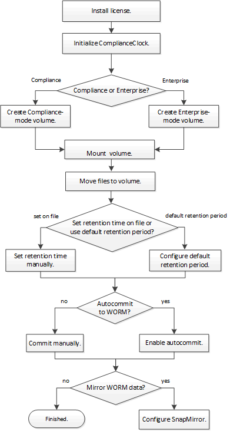

= SnapLock ワークフロー
:icons: font
:imagesdir: ../media/

[role="lead"]
SnapLock アグリゲートを作成するときに、使用する SnapLock モードとして Compliance または Enterprise を指定します。作成する SnapLock ボリュームは設定を継承します。通常、ファイルアーカイブアプリケーションを使用してプライマリストレージから SnapLock ボリュームにファイルを移動します。

