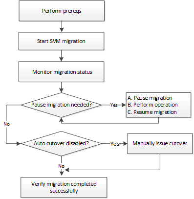

= SVM のデータ移動の概要
:icons: font
:imagesdir: ../media/

[role="lead"]
ONTAP 9.10.1 以降のクラスタ管理者は、ソースクラスタからデスティネーションクラスタに SVM を無停止で再配置して容量と負荷分散を管理したり、機器のアップグレードやデータセンターの統合を行ったりすることができます。この機能は、 ONTAP 9.10.1 の AFF アレイでのみサポートされます。iSCSI ワークロードはサポートされません。

SVM の名前と UUID は、移行後も変更されず、データ LIF 名、 IP アドレス、ボリューム名などのオブジェクト名も変更されません。SVM 内のオブジェクトの UUID は異なります。

== SVM 移行ワークフロー

次の図は、 SVM 移行の一般的なワークフローを示しています。SVM の移行はデスティネーションクラスタから開始します。移行元または移行先のどちらからでも移行を監視できます。手動カットオーバーまたは自動カットオーバーを実行できます。自動カットオーバーはデフォルトで実行されます。

== サポートされている構成

サポートされる構成は次のとおりです。

* AFF アレイのみ
* ソースとデスティネーションの両方のノードクラスタのみ
* データセンター内での移行、および最大ネットワークレイテンシは 2 ミリ秒

== 前提条件

* クラスタ管理者である。
* ソースクラスタとデスティネーションクラスタ間にピア関係が設定されている
* ソースクラスタとデスティネーションクラスタには、 Data Protection Bundle ライセンスがインストールされています
* ソースクラスタ内のすべてのノードで ONTAP 9.10.1 以降が実行されている必要があります
* ソースクラスタ内のすべてのノードで同じバージョンの ONTAP を実行している必要があります
* デスティネーションクラスタでソースクラスタと同じか新しい有効なクラスタバージョン（ ECV ）が使用されています
* ソースクラスタとデスティネーションクラスタが同じ L2 ネットワークにあり、同じ VLAN 内に存在する必要があります
* ソース SVM に含まれるボリュームがリリースでサポートされる最大データボリューム数よりも少なくなっています。
+
ONTAP 9.10.1 では、サポートされるデータボリュームの最大数は 100 です。

* デスティネーションにボリュームを配置できるだけの十分なスペースがある
* ソース SVM に暗号化されたボリュームがある場合は、デスティネーションでオンボードキーマネージャを設定する必要があります

== 競合する操作

SVM の移行と競合する可能性がある処理がないかどうかを確認する必要があります。

* 実行中のフェイルオーバー処理はありません
* wafliron を実行できない
* フィンガープリントを実行中ではありません
* SMTape が実行されていません
* vol move 、 rehost 、 clone 、 create 、 convert 、または analytics が実行されていません

== サポートされている機能

ONTAP 9.10.1 では次の機能がサポートされます。

* NFS v3 、 NFS v4.1 、および NFS v4.2 プロトコル
* NetApp Volume Encryption の略

== サポートされない機能です

SVM の移行では、次の機能はサポートされていません。

* iSCSI ワークロード
* IPv6 LIF
* ソースクラスタのオンボードキーマネージャ（ OKM ）で CC モードが有効な場合の SVM の移行
* SVM ピアリング、 SnapMirror 、データ保護ボリューム
* SAN 、 NVMe over Fibre 、 CIFS 、スキャン、 NFS v4.0 、 vStorage 、 S3 レプリケーション
* 監査
* NDMP
* VIP/BGP LIF
* IPSec ポリシー
* ランサムウェア対策
* qtree 、クォータ
* SVM-DR
* デスティネーションクラスタの外部キーマネージャ
* SnapMirror
* SnapLock
* FlexGroup
* FlexCache
* FabricPool
* Flash Pool アグリゲート
* MetroCluster
* System Manager の略
* VSC の登録を行う
* ボリュームクローン
* FAS アレイ
* 負荷共有ミラー
* Cloud Volumes ONTAP

