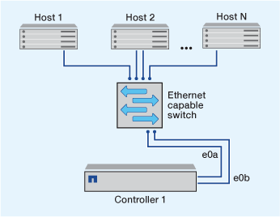
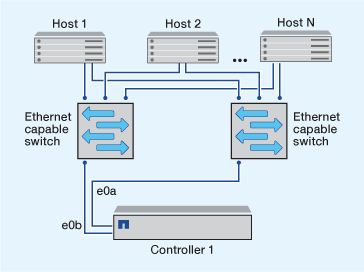

= シングルノードクラスタを管理します。
:allow-uri-read: 
:icons: font
:imagesdir: ../media/

[role="lead"]
シングルノードクラスタは、スタンドアロンノード上でクラスタを実行する特殊な実装です。  シングルノードクラスタは冗長性を提供しないため、推奨されません。  ノードが停止すると、データアクセスが失われます。

[NOTE]
====
フォールトトレランスとノンストップオペレーションを実現するためには、 link:../concepts/high-availability-pairs-concept.html["ハイアベイラビリティ（HAペア）"]。

====
シングルノードクラスタを構成またはアップグレードする場合は、次の点に注意してください。

* シングルノードクラスタではルートボリュームの暗号化はサポートされません。
* ノードを削除してシングルノードクラスタにする場合は、データトラフィックを処理するようにクラスタポートを変更する必要があります。そのためには、クラスタポートがデータポートになるように変更し、そのデータポートにデータLIFを作成します。
* シングルノードクラスタの場合は、ソフトウェアのセットアップ時に構成のバックアップ先を指定できます。セットアップ後は、 ONTAP コマンドを使用して設定を変更できます。
* ノードに接続するホストが複数ある場合は、各ホストでオペレーティングシステム（WindowsやLinuxなど）を設定できます。ホストからコントローラへのパスが複数ある場合は、ホストで ALUA を有効にする必要があります。

== シングルノードを使用する iSCSI SAN ホストの構成方法

iSCSI SANホストは、単一のノードに直接接続するように設定することも、1つ以上のIPスイッチを介して接続するように設定することもできます。ノードからスイッチに複数のiSCSI接続を確立できます。

.直接接続型のシングルノード構成
直接接続型のシングルノード構成では、1つ以上のホストをノードに直接接続します。

image::../media/scrn_en_drw_fc-302020-direct-sing-on.png[1 つ以上のホストをノードに直接接続した、直接接続型のコントローラの図]

.シングルネットワークのシングルノード構成
シングルネットワークのシングルノード構成では、 1 つのノードを 1 台のスイッチで 1 つまたは複数のホストに接続します。スイッチが 1 台しかないため、この構成では完全な冗長性は確保されません。

.マルチネットワークのシングルノード構成
マルチネットワークのシングルノード構成では、 1 つのノードを複数のスイッチで 1 つまたは複数のホストに接続します。スイッチが複数あるため、この構成では完全な冗長性が確保されます。

== シングルノードを使用する FC および FC-NVMe SAN ホストの構成方法

シングルノードの FC および FC-NVMe SAN ホストは、 1 つ以上のファブリック経由で接続するように構成できます。N-Port ID Virtualization （ NPIV ； N ポート ID 仮想化）が必要で、ファブリック内のすべての FC スイッチで有効にする必要があります。FC または FC-NVMe SAN ホストを FC スイッチを使用せずにシングルノードに直接接続することはできません。

.単一ファブリックのシングルノード構成
単一ファブリックのシングルノード構成では、 1 つのノードを 1 台のスイッチで 1 つまたは複数のホストに接続します。スイッチが 1 台しかないため、この構成では完全な冗長性は確保されません。

単一ファブリックのシングルノード構成では、ホストからノードへのパスが 1 つしかない場合、マルチパスソフトウェアは必要ありません。

.マルチファブリックのシングルノード構成
マルチファブリックのシングルノード構成では、 1 つのノードを複数のスイッチで 1 つまたは複数のホストに接続します。次の図は、マルチファブリックのシングルノード構成を示しています。わかりやすいように、この図ではファブリックが 2 つだけになっていますが、マルチファブリック構成は 2 つ以上の任意の数のファブリックで構成できます。この図では、上のシャーシにストレージコントローラが取り付けられています。下のシャーシは、この例のように空けておくか、 IOMX モジュールを使用したりできます。

次の図の FC ターゲットポート（ 0a 、 0c 、 0b 、 0d ）は一例です。実際のポート番号は、使用しているストレージノードのモデル、および拡張アダプタを使用しているかどうかによって異なります。

image::../media/scrn_en_drw_fc-62xx-multi-singlecontroller.png[マルチファブリックのシングルノード構成の図]

.関連情報
http://www.netapp.com/us/media/tr-4684.pdf["NetAppテクニカルレポート4684：『Implementing and Configuring Modern SANs with NVMe-oF』"^]

== シングルノードクラスタでのONTAPのアップグレード

ONTAP 9.2以降では、ONTAP CLIを使用してシングルノードクラスタの自動更新を実行できます。シングルノードクラスタは冗長性に欠けるため、更新時は必ずシステムの停止を伴います。停止を伴うアップグレードは、System Managerでは実行できません。

.作業を開始する前に
アップグレードを完了する必要があります link:../upgrade/prepare.html["準備"] 手順。

.手順
. 以前の ONTAP ソフトウェアパッケージを削除します。
+
[source, cli]
----
cluster image package delete -version previous_package_version
----
. ターゲットの ONTAP ソフトウェアパッケージをダウンロードします。
+
[source, cli]
----
cluster image package get -url location
----
+
[listing]
----
cluster1::> cluster image package get -url http://www.example.com/software/9.7/image.tgz

Package download completed.
Package processing completed.
----
. ソフトウェアパッケージがクラスタパッケージリポジトリにあることを確認します。
+
[source, cli]
----
cluster image package show-repository
----
+
[listing]
----
cluster1::> cluster image package show-repository
Package Version  Package Build Time
---------------- ------------------
9.7              M/DD/YYYY 10:32:15
----
. クラスタをアップグレードする準備が完了していることを確認します。
+
[source, cli]
----
cluster image validate -version package_version_number
----
+
[listing]
----
cluster1::> cluster image validate -version 9.7

WARNING: There are additional manual upgrade validation checks that must be performed after these automated validation checks have completed...
----
. 検証の進捗を監視します。
+
[source, cli]
----
cluster image show-update-progress
----
. 検証で特定された必要なアクションをすべて完了します。
. 必要に応じて、ソフトウェアアップグレードの見積もりを生成します。
+
[source, cli]
----
cluster image update -version package_version_number -estimate-only
----
+
ソフトウェアアップグレードの見積もりには、更新対象の各コンポーネントの詳細とアップグレードの推定期間が表示されます。

. ソフトウェアのアップグレードを実行します。
+
[source, cli]
----
cluster image update -version package_version_number
----
+

NOTE: 問題が検出されると、更新が一時停止し、措置を講じるように求められます。問題の詳細や更新の進捗を確認するには、 cluster image show-update-progress コマンドを使用します。問題を修正したら、 cluster image resume-update コマンドを使用して更新を再開できます。

. クラスタの更新の進捗を表示します。
+
[source, cli]
----
cluster image show-update-progress
----
+
ノードは更新の一環としてリブートされ、リブート中はアクセスできません。

. 通知をトリガーします。
+
[source, cli]
----
autosupport invoke -node * -type all -message "Finishing_Upgrade"
----
+
メッセージを送信するようにクラスタが設定されていない場合は、通知のコピーがローカルに保存されます。

