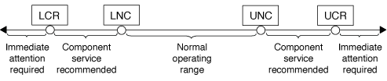

= しきい値ベースの SP センサーの読み取り値と system sensors コマンドのステータス値について説明します
:allow-uri-read: 
:icons: font
:imagesdir: ../media/

[role="lead"]
しきい値ベースのセンサーは、さまざまなシステムコンポーネントを定期的に読み取ります。SP は、しきい値ベースのセンサーの読み取り値を、コンポーネントの許容可能な動作条件を定義する事前設定されたしきい値と比較します。

SP は、センサーの読み取り値に基づいてセンサーの状態を表示し、コンポーネントの状態の監視に役立ちます。

しきい値ベースのセンサーには、システム温度、電圧、電流、ファン速度のセンサーなどがあります。しきい値ベースのセンサーのリストは、プラットフォームによって異なります。

しきい値ベースのセンサーには次のしきい値があり、これらは SP の「 system sensors 」コマンドの出力に表示されます。

* 異常 - 下限（ LCR ）
* 異常 - 下限（ LNC ）
* 異常 - 上限（ UNC ）
* 重大 - 上限（ UCR ）

センサー読み取り値が LNC と LCR の間、または UNC と UCR の間の場合は、コンポーネントが問題の兆候を示しており、その結果、システムに障害が発生する可能性があることを示します。そのため、コンポーネントの保守をすぐに計画する必要があります。

センサーの読み取り値が LCR 以下、または UCR 以上の場合は、コンポーネントが誤動作しており、システム障害が発生しつつあることを意味します。したがって、コンポーネントに対して緊急な対応が必要です。

次の図に、しきい値と対応する重大度の範囲を示します。

しきい値ベースのセンサーの読み取り値は、「 system sensors 」コマンド出力の「 Current 」列に表示されます。「 system sensors get ``sensor_name` 」コマンドは、指定したセンサーの追加情報を表示します。読み取り値が異常および重大のしきい値を超えると、センサーは重大度が上昇していることを報告します。読み取り値がしきい値の制限を超えると、「システム・センサー」コマンド出力のセンサーのステータスは、しきい値の超過に応じて「 OK 」から「 NC 」（異常）または「 CR 」（重大）に変わり、 SEL イベント・ログにイベント・メッセージが記録されます。

しきい値ベースのセンサーには、 4 つのしきい値レベルが全部揃っていないものもあります。これらのセンサーの場合、しきい値がないと「 system sensors 」コマンド出力の制限値として「 na 」が表示されます。この場合、特定のセンサーに該当するしきい値または重大度が設定されていないことを意味し、 SP はそのしきい値についてセンサーを監視しません。

.system sensorsコマンド出力の例を示します
次の例に、 SP CLI の「 system sensors 」コマンドで表示される情報の一部を示します。

[listing]
----
SP node1> system sensors

Sensor Name      | Current    | Unit       | Status| LCR       | LNC       | UNC       | UCR
-----------------+------------+------------+-------+-----------+-----------+-----------+-----------
CPU0_Temp_Margin | -55.000    | degrees C  | ok    | na        | na        | -5.000    | 0.000
CPU1_Temp_Margin | -56.000    | degrees C  | ok    | na        | na        | -5.000    | 0.000
In_Flow_Temp     | 32.000     | degrees C  | ok    | 0.000     | 10.000    | 42.000    | 52.000
Out_Flow_Temp    | 38.000     | degrees C  | ok    | 0.000     | 10.000    | 59.000    | 68.000
CPU1_Error       | 0x0        | discrete   | 0x0180| na        | na        | na        | na
CPU1_Therm_Trip  | 0x0        | discrete   | 0x0180| na        | na        | na        | na
CPU1_Hot         | 0x0        | discrete   | 0x0180| na        | na        | na        | na
IO_Mid1_Temp     | 30.000     | degrees C  | ok    | 0.000     | 10.000    | 55.000    | 64.000
IO_Mid2_Temp     | 30.000     | degrees C  | ok    | 0.000     | 10.000    | 55.000    | 64.000
CPU_VTT          | 1.106      | Volts      | ok    | 1.028     | 1.048     | 1.154     | 1.174
CPU0_VCC         | 1.154      | Volts      | ok    | 0.834     | 0.844     | 1.348     | 1.368
3.3V             | 3.323      | Volts      | ok    | 3.053     | 3.116     | 3.466     | 3.546
5V               | 5.002      | Volts      | ok    | 4.368     | 4.465     | 5.490     | 5.636
STBY_1.8V        | 1.794      | Volts      | ok    | 1.678     | 1.707     | 1.892     | 1.911
…
----
.しきい値ベースのセンサーのsystem sensors sensor_nameコマンド出力の例
次に、しきい値ベースのセンサー 5V について SP CLI に「 system sensors get 'sensor_name' 」と入力した結果の例を示します。

[listing]
----
SP node1> system sensors get 5V

Locating sensor record...
Sensor ID              : 5V (0x13)
 Entity ID             : 7.97
 Sensor Type (Analog)  : Voltage
 Sensor Reading        : 5.002 (+/- 0) Volts
 Status                : ok
 Lower Non-Recoverable : na
 Lower Critical        : 4.246
 Lower Non-Critical    : 4.490
 Upper Non-Critical    : 5.490
 Upper Critical        : 5.758
 Upper Non-Recoverable : na
 Assertion Events      :
 Assertions Enabled    : lnc- lcr- ucr+
 Deassertions Enabled  : lnc- lcr- ucr+
----