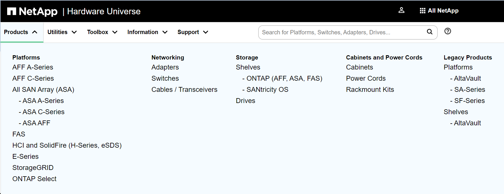

= ストレージの制限
:allow-uri-read: 
:icons: font
:imagesdir: ../media/

[role="lead"]
ストレージオブジェクトには、ストレージアーキテクチャを計画および管理するときに考慮する必要がある制限があります。

制限は多くの場合、プラットフォームによって異なります。を参照してください link:https://hwu.netapp.com/["NetApp Hardware Universe の略"^] をクリックして、それぞれの構成の制限事項を確認してください。を参照してください <<hwu>> ONTAP構成に適した情報を特定する手順については、を参照してください。

制限は次のセクションに記載されています。

* <<vollimits>>
* <<flexclone>>

Cloud Volumes ONTAP でのストレージの制限については、を参照してください link:https://docs.netapp.com/us-en/cloud-volumes-ontap/["Cloud Volumes ONTAP リリースノート"^]。

== ボリュームの制限

[cols="4*"]
|===
| ストレージオブジェクト | 制限（ Limit ） | ネイティブストレージ | ストレージアレイ 

 a| 
* アレイ LUN *
 a| 
ルートボリュームの最小サイズ ^1
 a| 
該当なし
 a| 
モデルによって異なります

 a| 
* ファイル *
 a| 
最大サイズ
 a| 
バージョンに依存^2^
 a| 
バージョンに依存^2^

 a| 
ボリュームあたりの最大数^4^
 a| 
ボリュームサイズに依存、最大20億
 a| 
ボリュームサイズに依存、最大20億

 a| 
* FlexClone ボリューム *
 a| 
クローン階層の深さ^5^
 a| 
499
 a| 
499

 a| 
* FlexVol ボリューム *
 a| 
ノードあたりの最大値 ^1 ^
 a| 
モデルによって異なります
 a| 
モデルによって異なります

 a| 
各SVMのノードあたりの最大数^6^
 a| 
モデルによって異なります
 a| 
モデルによって異なります

 a| 
最小サイズ
 a| 
20MB
 a| 
20MB

 a| 
最大サイズ ^1 ^
 a| 
モデルによって異なります
 a| 
モデルによって異なります

 a| 
* プライマリワークロード用の FlexVol ボリューム *
 a| 
ノードあたりの最大数^3^
 a| 
モデルによって異なります
 a| 
モデルによって異なります

 a| 
* FlexVol ルートボリューム *
 a| 
最小サイズ ^1 ^
 a| 
モデルによって異なります
 a| 
モデルによって異なります

 a| 
* LUN*
 a| 
ノードあたりの最大数^6^
 a| 
モデルによって異なります
 a| 
モデルによって異なります

 a| 
クラスタあたりの最大数^6^
 a| 
モデルによって異なります
 a| 
モデルによって異なります

 a| 
ボリュームあたりの最大値 ^6^
 a| 
モデルによって異なります
 a| 
モデルによって異なります

 a| 
最大サイズ
 a| 
バージョンに依存^2^
 a| 
バージョンに依存^2^

 a| 
* qtree *
 a| 
FlexVol あたりの最大数
 a| 
4,995人
 a| 
4,995人

 a| 
* Snapshot コピー *
 a| 
ボリュームあたりの最大数^7^
 a| 
255/1023
 a| 
255/1023

 a| 
* ボリューム *
 a| 
NAS のクラスタあたりの最大数
 a| 
12、000
 a| 
12、000

 a| 
SAN プロトコルが設定されたクラスタあたりの最大数
 a| 
モデルによって異なります
 a| 
モデルによって異なります

|===
* 注： *

. ONTAP 9.3 以前では、ボリュームに格納できる Snapshot コピーは最大 255 個です。ONTAP 9.4 以降では、ボリュームに格納できる Snapshot コピーは最大 1023 個です。
. ONTAP 9.12.1P2以降では、上限は128TBです。ONTAP 9.11.1以前のバージョンでは、最大16TBです。
. ONTAP FlexVol 9.7以降では、128GB以上のメモリを搭載したAFFプラットフォームでサポートされるFlexVolの最大数がノードあたり2、500個に引き上げられました。
+
プラットフォーム固有の情報およびサポートの最新情報については、を参照してください https://hwu.netapp.com/["Hardware Universe"^]。

. 20 億 =2 × 10^9^ 。
. 1 つの FlexVol から作成できる、ネストされた FlexClone ボリュームの最大階層数。
. この制限は SAN 環境にのみ適用されます。
+
link:../san-config/index.html["SAN構成"]

. SnapMirror カスケード構成を使用してこの制限を引き上げることができます。

== FlexClone ファイルと FlexClone LUN の制限

[cols="3*"]
|===
| 制限（ Limit ） | ネイティブストレージ | ストレージアレイ 

 a| 
** ファイルまたは LUN あたりの最大数 **^1
 a| 
32、767
 a| 
32、767

 a| 
* FlexVol ボリュームあたりの最大合計共有データ数 *
 a| 
640 TB
 a| 
640 TB

|===
* 注： *

. 32 、 767 個を超えるクローンを作成しようとすると、親ファイルまたは親 LUN の新しい物理コピーが ONTAP によって自動的に作成されます。
+
重複排除を使用する FlexVol の場合、上限値はこれよりも低い可能性があります。

== NetApp Hardware Universeのナビゲート

プラットフォーム固有の制限およびモデルに依存する制限については、を参照してください。 link:https://hwu.netapp.com/["NetApp Hardware Universe の略"^]。

.手順
. [** Products*]ドロップダウンメニューで、ハードウェア構成を選択します。
+

. プラットフォームを選択します。
+
image::../media/hardware-universe-platforms.png[Hardware Universeの[Platforms]メニュー]

. 適切なバージョンのONTAPを選択し、**Show Results**を選択します。
+
image::../media/hardware-universe-os-filter.png[Hardware Universe OSフィルタメニュー]

.関連情報
https://www.netapp.com/cloud-services/cloud-manager/documentation/["使用しているバージョンの Cloud Volumes ONTAP のリリースノートを検索してください"]
