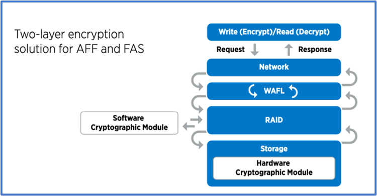

= ONTAPでデータ主体のアプローチでゼロトラストを実現
:allow-uri-read: 
:icons: font
:imagesdir: ../media/

[role="lead"]
ゼロトラストネットワークは、データ中心のアプローチによって定義され、セキュリティ制御は可能な限りデータに近いものにする必要があります。ONTAPの機能とNetApp FPolicyパートナーエコシステムを組み合わせることで、データ中心のゼロトラストモデルに必要な制御を提供できます。

ONTAPは、NetAppが提供するセキュリティリッチなデータ管理ソフトウェアです。FPolicyゼロトラストエンジンは業界をリードするONTAP機能で、きめ細かなファイルベースのイベント通知インターフェイスを提供します。NetAppのFPolicyパートナーは、このインターフェイスを使用して、ONTAP内のデータアクセスの照度を高めることができます。

image::../media/zero-trust-architecture.png[ゼロトラストアーキテクチャ図]

== ゼロトラストのデータ主体のMCAPを設計

データ中心のゼロトラストMCAPを設計するには、次の手順を実行します。

. すべての組織データの場所を特定します。
. データを分類
. 不要になったデータを安全に破棄できます。
. データ分類へのアクセス権を持つ役割を理解する。
. 最小権限の原則を適用して、アクセス制御を適用します。
. 管理アクセスとデータアクセスに多要素認証を使用します。
. 保存中のデータと転送中のデータに暗号化を使用
. すべてのアクセスを監視してログに記録します。
. 不審なアクセスまたは動作を警告します。

=== すべての組織データの場所を特定する

ONTAPのFPolicy機能とパートナーのNetAppアライアンスパートナーエコシステムを組み合わせることで、組織のデータがどこに存在し、誰がデータにアクセスできるかを特定できます。これには、データアクセスパターンが有効かどうかを特定するユーザ行動分析が使用されます。ユーザーの行動分析の詳細については、「すべてのアクセスを監視してログに記録する」を参照してください。データがどこにあり、誰がデータにアクセスできるかを理解していない場合、ユーザー行動分析は、経験的観察から分類とポリシーを構築するためのベースラインを提供できます。

=== データを分類

ゼロトラストモデルの用語では、データの分類には毒性データの識別が含まれます。有害データとは、組織の外部に公開することを意図していない機密データです。有害なデータの開示は、規制コンプライアンスに違反し、組織の評判を損なう可能性があります。規制コンプライアンスの観点から、有害データには、のカード所有者データ、EUの個人データ、またはの医療データが含まれます https://www.netapp.com/us/media/tr-4401.pdf["クレジットカード業界の データ セキュリティ 標準 (PCI-DSS)"^] https://www.netapp.com/us/info/gdpr.aspx["一般データ保護規則（GDPR）"^] https://www.hhs.gov/hipaa/for-professionals/privacy/laws-regulations/index.html["医療保険の携行性と責任に関する法律（HIPAA）"^]。AIベースのツールキットであるNetApp（旧称Cloud Data Sense）を使用すると、データを自動的にスキャン、分析、分類でき https://bluexp.netapp.com/netapp-cloud-data-sense["BlueXPの分類"^] ます。

=== 不要になったデータを安全に廃棄

組織のデータを分類した後、一部のデータが不要になったり、組織の機能と関連性がなくなったりすることがあります。不要なデータの保持は責任であり、そのようなデータは削除する必要があります。暗号化によってデータを消去する高度なメカニズムについては、「保存データの暗号化」でのセキュアパージの説明を参照してください。

=== データ分類へのアクセス権が必要な役割を理解し、アクセス制御を実施するために最小権限の原則を適用する

機密データへのアクセスをマッピングし、最小権限の原則を適用すると、組織内のユーザーに、業務の遂行に必要なデータのみにアクセスできるようになります。このプロセスにはロールベースアクセス制御が含まれ (https://docs.netapp.com/us-en/ontap/authentication/index.html["RBAC"^]ます）。これは、データアクセスと管理アクセスに適用されます。

ONTAPでは、Storage Virtual Machine（SVM）を使用して、ONTAPクラスタ内のテナントによる組織のデータアクセスを分割できます。RBACは、SVMへのデータアクセスと管理アクセスに適用できます。RBACはクラスタ管理レベルでも適用できます。

RBACに加えて、ONTAP（MAV）を使用して、またはなどのコマンドの承認を1人以上の管理者に要求することができます link:../multi-admin-verify/index.html["マルチ管理者認証"] `volume delete` `volume snapshot delete`。MAVを有効にすると、MAVを変更または無効にするには、MAV管理者の承認が必要になります。

スナップショットを保護するもう1つの方法は、ONTAPlink:../snaplock/snapshot-lock-concept.html["Snapshotロック"]です。Snapshotロックは、ボリュームSnapshotポリシーの保持期間に応じて手動または自動でSnapshotを消去できないようにするSnapLock機能です。スナップショットロックは、改ざん防止スナップショットロックとも呼ばれます。スナップショットロックの目的は、不正な管理者や信頼されていない管理者が、プライマリおよびセカンダリONTAPシステム上のスナップショットを削除するのを防ぐことです。ランサムウェアによって破損したボリュームをリストアするために、プライマリシステム上のロックされたSnapshotの迅速なリカバリを実現できます。

=== 管理アクセスとデータアクセスに多要素認証を使用

クラスタ管理のRBACに加えて、 https://www.netapp.com/us/media/tr-4647.pdf["多要素認証（MFA）"^] ONTAP Web管理アクセスおよびSecure Shell（SSH）コマンドラインアクセス用にも導入できます。管理者アクセスのためのMFAは、米国の公共機関またはPCI-DSSに従う必要がある組織の要件です。MFAを使用すると、攻撃者がユーザー名とパスワードのみを使用してアカウントを侵害することが不可能になります。MFAでは、認証に2つ以上の独立した要素が必要です。二要素認証の例としては、秘密鍵などのユーザが所有するものや、パスワードなどのユーザが知っているものがあります。ONTAP System ManagerまたはActiveIQ Unified Managerへの管理Webアクセスは、Security Assertion Markup Language（SAML）2.0で有効になります。SSHコマンドラインアクセスでは、公開鍵とパスワードを使用したチェーン型の2要素認証が使用されます。

ONTAPのIDおよびアクセス管理機能を使用して、APIを使用してユーザおよびマシンのアクセスを制御できます。

* ユーザ：
+
** *認証と承認。*SMBとNFSのNASプロトコル機能を介して提供
** *監査。*アクセスおよびイベントのsyslog。認証ポリシーと許可ポリシーをテストするためのCIFSプロトコルの詳細な監査ログ。詳細なNASアクセスをファイルレベルできめ細かくFPolicyで監査

* デバイス：
+
** *認証。*APIアクセス用の証明書ベースの認証。
** *承認。*デフォルトまたはカスタムのRole-Based Access Control（RBAC；ロールベースアクセス制御）。
** *監査。*実行されたすべてのアクションのsyslog。

=== 保存中のデータと転送中のデータに暗号化を使用

==== 保存データ暗号化

組織がドライブの転用、故障したドライブの返却、大容量ドライブの販売や取り引きを行ってドライブをアップグレードする際に、ストレージシステムのリスクとインフラのギャップを軽減するための新たな要件が日 々 発生しています。 ストレージエンジニアには、データの管理者や運用者として、データのライフサイクルを通じて安全にデータを管理、維持することが求められています。 https://www.netapp.com/us/media/ds-3898.pdf["NetAppストレージ暗号化（NSE）；NetAppボリューム暗号化（NVE）；およびNetAppアグリゲート暗号化"^] 毒性があるかどうかにかかわらず、日常の運用に影響を与えることなく、保管中のすべてのデータを常に暗号化できます。 https://www.netapp.com/us/media/ds-3213-en.pdf["NSE"^] は、FIPS 140-2レベル2認定自己暗号化ドライブを使用するONTAPハードウェアソリューションです link:../encryption-at-rest/index.html["保存データ"] 。 https://www.netapp.com/us/media/ds-3899.pdf["NVEおよびNAE"^] は、を使用するONTAPソフトウェアソリューションです link:../encryption-at-rest/index.html["保存データ"] https://csrc.nist.gov/projects/cryptographic-module-validation-program/certificate/4144["FIPS 140-2レベル1認定NetApp暗号モジュール"^]。NVEおよびNAEでは、ハードドライブまたはソリッドステートドライブのいずれかを使用して保存データを暗号化できます。さらに、NSEドライブを使用して、暗号化の冗長性とセキュリティを強化するネイティブの階層型暗号化ソリューションを提供できます。1つのレイヤに違反しても、2つ目のレイヤでデータが保護されます。これらの機能により、ONTAPはに適しています https://www.netapp.com/us/media/sb-3952.pdf["Quantum対応の暗号化"^]。

NVEには、機密ファイルが分類されていないボリュームに書き込まれたときに、暗号化によってデータ流出から有害なデータを削除するという機能もあります。 https://blog.netapp.com/flash-memory-summit-award/["セキュアパージ"^]

ONTAPに組み込まれているキー管理ツールであるを link:../encryption-at-rest/support-storage-encryption-concept.html["オンボードキーマネージャ（ OKM ）"]使用するか、 https://mysupport.netapp.com/matrix/imt.jsp?components=69551;&solution=1156&isHWU&src=IMT["承認済み"^] またはサードパーティ製品 link:../encryption-at-rest/support-storage-encryption-concept.html["カイフキカンリツル"] をNSEおよびNVEと併用して、キー情報をセキュアに格納できます。

上の図に示すように、ハードウェアベースとソフトウェアベースの暗号化を組み合わせることができます。この機能により、ではトップシークレットデータの保存が可能になり https://www.netapp.com/blog/netapp-ontap-CSfC-validation/["分類されたプログラムのためのNSAの商用ソリューションへのONTAPの検証"^] ました。

==== 転送中データの暗号化

ONTAPの転送中データ暗号化により、ユーザデータアクセスとコントロールプレーンアクセスが保護されます。ユーザデータアクセスは、Microsoft CIFS共有アクセスの場合はSMB 3.0暗号化、NFS Kerberos 5の場合はkrb5pによって暗号化できます。ユーザデータアクセスは、を使用してCIFS、NFS、iSCSIの暗号化することもできます link:../networking/ipsec-prepare.html["IPSec"] 。コントロールプレーンアクセスは、Transport Layer Security（TLS）で暗号化されます。ONTAPには、コントロールプレーンアクセスのコンプライアンスモードが用意されてlink:https://docs.netapp.com/us-en/ontap-cli//security-config-modify.html["FIPS"^]います。このモードでは、FIPS承認のアルゴリズムが有効になり、FIPS承認でないアルゴリズムが無効になります。データレプリケーションはで暗号化され link:../peering/enable-cluster-peering-encryption-existing-task.html["クラスタピア暗号化"]ます。これにより、ONTAP SnapVaultテクノロジとSnapMirrorテクノロジが暗号化されます。

=== すべてのアクセスを監視してログに記録

RBACポリシーを設定したら、アクティブな監視、監査、アラートを導入する必要があります。NetApp ONTAPのFPolicyゼロトラストエンジンとを組み合わせること https://www.netapp.com/partners/partner-connect["NetApp FPolicyパートナーエコシステム"^]で、データ主体のゼロトラストモデルに必要な制御を実現できます。NetApp ONTAPは、セキュリティが充実したデータ管理ソフトウェアであり link:../nas-audit/two-parts-fpolicy-solution-concept.html["FPolicy"] 、きめ細かなファイルベースのイベント通知インターフェイスを提供する、業界をリードするONTAP機能です。NetAppのFPolicyパートナーは、このインターフェイスを使用して、ONTAP内のデータアクセスの照度を高めることができます。ONTAPのFPolicy機能とFPolicyパートナーのNetAppアライアンスパートナーエコシステムを組み合わせることで、組織のデータがどこに存在し、誰がデータにアクセスできるかを特定できます。これには、データアクセスパターンが有効かどうかを特定するユーザ行動分析が使用されます。ユーザの行動分析を使用すると、通常のパターンから外れた不審なデータアクセスや異常なデータアクセスをアラートで通知し、必要に応じてアクセスを拒否するアクションを実行できます。

FPolicyパートナーは、ユーザ行動分析にとどまらず、機械学習（ML）や人工知能（AI）に移行しつつあります。これにより、イベントの忠実度が向上し、誤検出があった場合にはそれを減らすことができます。すべてのイベントは、syslogサーバ、またはMLやAIを使用できるセキュリティ情報イベント管理（SIEM）システムに記録する必要があります。

image::../media/zero-trust-fpolicy-architecture.png[FPolicyのアーキテクチャ図]

ネットアップのストレージワークロードセキュリティ（旧称： https://docs.netapp.com/us-en/cloudinsights/cs_intro.html["Cloud Secure"^]）は、クラウドとオンプレミスの両方のONTAPストレージシステムでFPolicyインターフェイスとユーザ行動分析を使用して、悪意のあるユーザの行動に関するリアルタイムのアラートを提供します。Storage Workload Securityは、高度な機械学習と異常検出機能を通じて、悪意のあるユーザや不正ユーザによる不正使用を防ぎます。Storage Workload Securityは、ランサムウェア攻撃やその他の不正な行動を特定し、スナップショットを起動して悪意のあるユーザを隔離できます。Storage Workload Securityには、ユーザとエンティティのアクティビティの詳細を表示するフォレンジック機能もあります。ストレージワークロードセキュリティはNetApp Cloud Insightsの一部です。

ONTAPには、ストレージワークロードのセキュリティに加えて、（ARP）と呼ばれるランサムウェア検出機能が搭載され link:../anti-ransomware/index.html["自律型ランサムウェア対策"] ています。ARPは機械学習を使用して、ランサムウェア攻撃が進行中であることを示す異常なファイルアクティビティがないかどうかを判断し、スナップショットを呼び出して管理者にアラートを送信します。Storage Workload Securityは、ONTAPと統合してARPイベントを受信し、追加の分析機能と自動応答レイヤを提供します。

この手順で説明されているコマンドの詳細については、をlink:https://docs.netapp.com/us-en/ontap-cli/["ONTAPコマンド リファレンス"^]参照してください。
